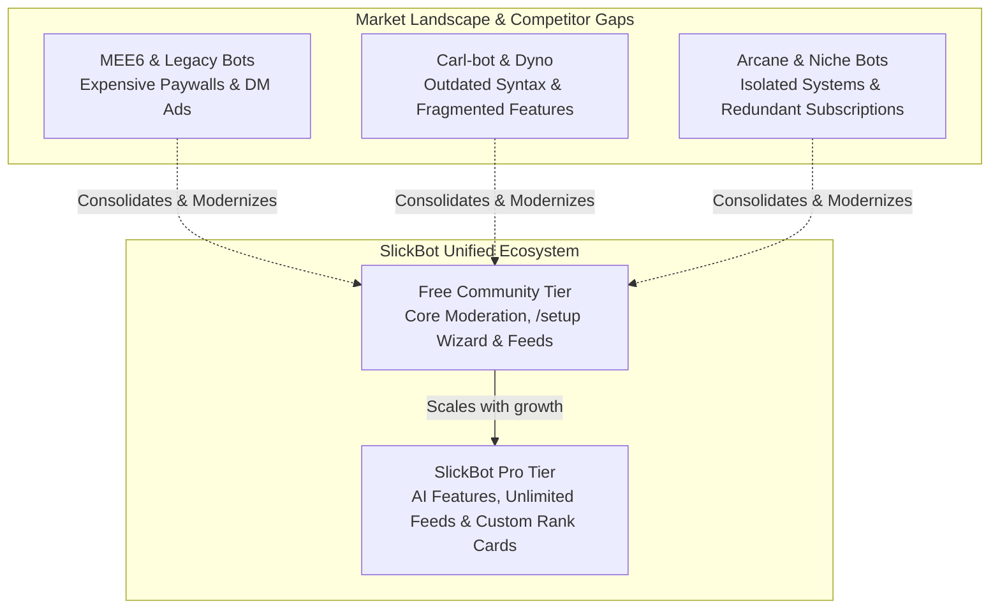
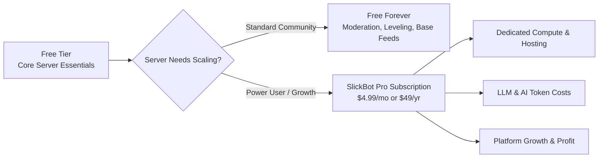
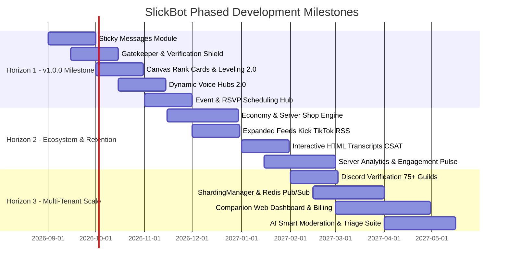
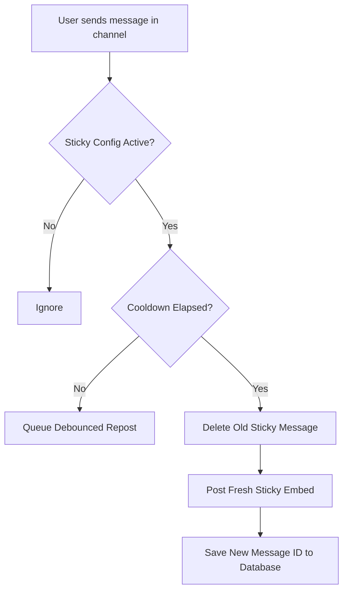
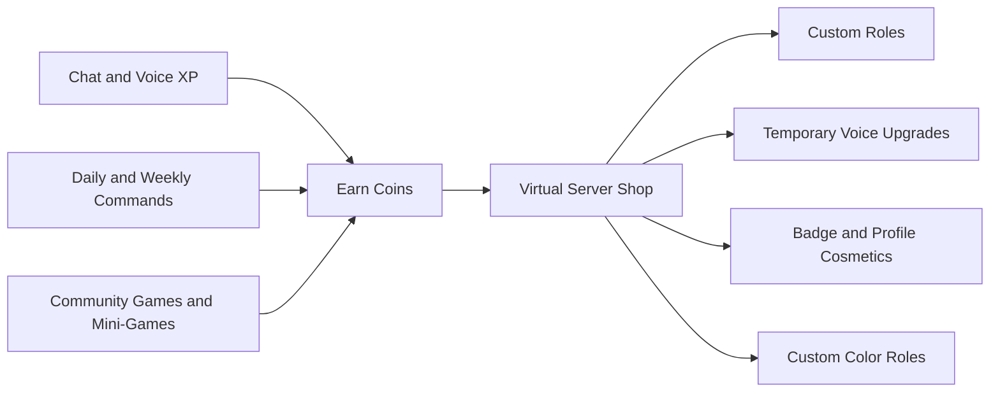
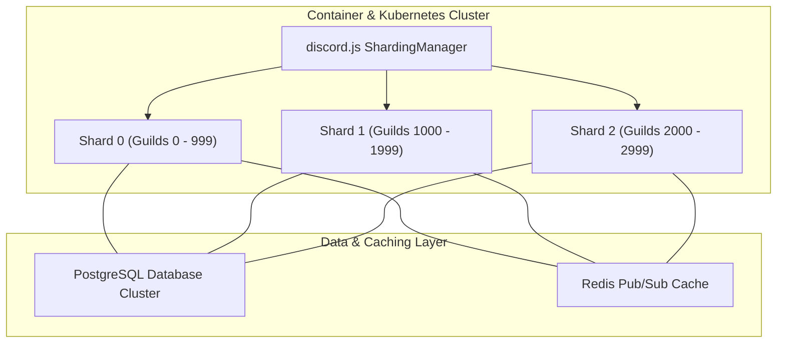

# 🗺️ SlickBot Comprehensive Development Roadmap

## Executive Summary & Strategic Vision

**SlickBot** is an enterprise-grade, all-in-one Discord server management bot built on **Node.js, Discord.js v14, and PostgreSQL**. Engineered originally for high-performance community management, SlickBot combines modular architecture, strict database multi-tenancy, granular role-based permissions, and rich in-Discord UI panels (`/setup`, buttons, select menus, modals) that eliminate the friction of traditional bot configuration.

As SlickBot transitions from a private server powerhouse into a scalable multi-server platform, this **Development Roadmap** defines the strategic trajectory:
1. **Competitive Superiority:** Outperforming legacy competitors (MEE6, Carl-bot, Dyno, Ticket Tool, Arcane) by offering modern Discord UI ergonomics, deep cross-module synergy, and high-value management features.
2. **Financial Sustainability & Fair Premium Tiers:** Establishing a transparent, sustainable freemium model (SlickBot Pro) that funds database hosting, server compute, web infrastructure, and AI token costs while generating long-term revenue.
3. **Next-Generation Modules:** Introducing high-demand capabilities including Persistent Sticky Messages, Gatekeeper Verification & Anti-Raid Shield, Canvas-Rendered Rank Cards, Dynamic Voice Hubs 2.0, Server Economy & Shop, and Event/RSVP Hubs.
4. **Platform & Service Expansions:** Broadening social tracking (Kick, TikTok, Reddit, Bluesky, RSS), AI-assisted moderation/triage, and exportable HTML transcripts.
5. **Multi-Tenant Public Scale:** Sharding architecture, Redis caching, Discord Bot Verification compliance, and a companion Web Management Dashboard.

---

## 📊 Competitive Landscape & Strategic Moat

To establish SlickBot as the premier Discord management solution, we analyze the current market leaders and define how SlickBot delivers a superior user, administrator, and monetization experience.



### Competitor Breakdown & SlickBot Advantages

| Competitor | Core Strengths | Critical Weaknesses & Pain Points | SlickBot Superiority & Opportunities |
| :--- | :--- | :--- | :--- |
| **MEE6** | Brand recognition, leveling, custom commands, basic moderation, music. | • Aggressive monetization ($12/mo or $89+ lifetime)<br>• Paywalls basic essentials (level role rewards, custom embeds)<br>• Spammy DM marketing to server members<br>• Rigid web-only configuration. | **Modern & Respectful Architecture:** Essential community management built-in, customizable level rewards, multiple social feeds, and rich embed builders directly in Discord without intrusive member DM ads. |
| **Carl-bot** | Advanced reaction roles, logging, tags/custom commands, starboard, automod. | • Outdated text syntax & steep learning curve<br>• Sluggish dashboard and legacy UI<br>• Lack of native guided setup wizards<br>• Limited cross-module interaction. | **Native Discord Component UI:** 100% interactive Discord modals, buttons, select menus, and `/setup` wizards that allow instant mobile and desktop administration without typing cryptic code syntax. |
| **Dyno** | Established moderation, custom commands, forms/appeals, auto-mod. | • Clunky appeal workflows<br>• Limited ticket flexibility<br>• Slow feature innovation<br>• Frequent dashboard downtime. | **Deep Moderation Integration:** Unified case management linking directly to tickets, appeals, automated notes, and **human-in-the-loop infraction escalation** with interactive confirmation modals. |
| **Ticket Tool / TicketsBot** | Specialized ticketing, transcript generation, claiming, escalation. | • Expensive premium tiers for multi-panel categories and custom embeds<br>• External transcript hosting costs<br>• No built-in leveling or referral synergy. | **Comprehensive Support Suite:** Native tickets, reports, applications, and appeals with custom question wizards, staff review threads, and downloadable self-contained HTML transcripts built-in. |
| **Arcane / AmariBot** | Leveling, voice XP, leaderboards. | • Minimal customization without subscription<br>• Static, plain rank cards<br>• Isolated from moderation and community achievements. | **Dynamic Synergy Leveling:** Voice XP, customizable Canvas/SVG rank cards, role multipliers, and automated cross-system integration with Server Achievements and Referrals. |
| **Streamcord / Now Live** | Twitch & YouTube notifications. | • Strict limits on feed counts (1–2 free feeds)<br>• Basic announcement embeds<br>• No live directory or member pairing. | **Live Stream Sticky Directory & Self-Service Alerts:** Multi-platform tracker with auto-updating live directory hubs, member-to-streamer pairing, and self-service `🔔 Get Alerts` subscriptions per creator. |

---

## 💰 Monetization, Premium Tiers & Financial Sustainability

To ensure SlickBot remains a financially viable platform that covers container compute, high-performance PostgreSQL hosting, Redis caching, web dashboard infrastructure, and AI API token costs, the platform implements a **structured, value-added Freemium model**.



### Free Community Tier vs. SlickBot Pro Tier

| Feature Area | Free Community Tier | SlickBot Pro Tier ($4.99/mo or $49/yr) |
| :--- | :--- | :--- |
| **Moderation & Safety** | Unlimited cases, notes, lock downs, AutoMod filters | Priority raid shield, automated AI toxic intent detection |
| **Support & Tickets** | Unlimited tickets, reports, appeals, applications | Interactive branded HTML transcripts, post-close CSAT surveys |
| **Social Feeds** | Up to 3 feeds (Twitch/YouTube) + Live Sticky Directory | Unlimited feeds (Kick, TikTok, Reddit, YouTube, Twitch, RSS) |
| **Leveling & XP** | Message & Voice XP, multiplier roles, standard card | Custom Canvas rank card background/theme uploads, double-XP events |
| **Custom Commands** | Up to 15 custom commands | Unlimited custom commands with advanced regex variables |
| **Knowledge Base & FAQ** | Standard FAQ command matching | AI-Powered Rule Q&A (`/ask`) with RAG embeddings |
| **Server Analytics** | 7-day activity metrics | 90-day retention funnels, heatmaps, CSV/PDF export |
| **Branding & Deployment** | Standard SlickBot branding | Custom Bot White-Labeling (custom bot name, avatar, status) |

---

## 🎯 Strategic Development Horizons



---

## 🚀 Horizon 1: Core Foundation & High-Impact Modules (v1.0.0 Target)

### 1.1 Sticky Messages Engine (`STICKY_MESSAGES`)
Keeps critical guidelines, templates, or channel rules pinned as the absolute newest message in active channels.



#### Step-by-Step Implementation:
1. **Database Schema:**
   - Create `sticky_message_configs` (`guild_id`, `channel_id`, `content`, `embed_data`, `cooldown_seconds`, `last_message_id`, `message_count_threshold`, `enabled`).
2. **Event Pipeline Integration:**
   - Attach listener in `interactionRouter.js` / `messageCreate` pipeline with a per-channel debounce map (`channelId -> Timeout`).
   - Implement rate-limit safety: Delete previous message only when a new chat threshold is met (e.g. every 3 messages or minimum 5 seconds).
3. **Command Suite & UI:**
   - `/sticky set [channel] [message] [embed_builder]`
   - `/sticky remove [channel]`
   - `/sticky list`
   - `/sticky manager` with interactive preview and toggle switches.
4. **Integration with `/setup`:**
   - Register under `AUTOMATION` category in `src/modules/moduleRegistry.js`.

---

### 1.2 Verification & Gatekeeper Shield (`VERIFICATION`)
Protects communities from automated raid bots, spammers, and malicious accounts through customizable entry gates.

#### Feature Capabilities:
* **Multiple Verification Modes:**
  1. *Button Click:* 1-click acceptance of server rules.
  2. *Interactive Captcha:* Dynamic visual/alphanumeric code generated via modal or image.
  3. *Questionnaire / Password Gate:* Requires users to answer a prompt or secret phrase.
* **Quarantine Role Lifecycle:**
  - Auto-assigns an unverified/quarantine role on join.
  - Automatically swaps unverified role for verified member role upon completion.
* **Raid Shield Velocity Lock:**
  - Auto-escalates verification mode (e.g. from Button to Captcha) if member join velocity spikes.

#### Step-by-Step Implementation:
1. **Database Schema:**
   - Create `verification_configs` (`guild_id`, `enabled`, `mode`, `channel_id`, `verified_role_id`, `unverified_role_id`, `captcha_type`, `welcome_message`, `log_channel_id`, `min_account_age_hours`).
   - Create `verification_attempts` (`guild_id`, `user_id`, `attempts`, `status`, `expires_at`).
2. **Verification Handler:**
   - Handle button/modal submissions in `interactionRouter.js`.
   - On success: execute atomic role add/remove, send ephemeral welcome, log verification event to `LOGGING` module.
3. **Commands & Dashboard:**
   - `/verify setup` (Interactive Wizard)
   - `/verify panel post [channel]`
   - `/verify bypass @User` (Staff override)
   - `/verify status`

---

### 1.3 Canvas Rank Cards & Leveling 2.0 (`LEVELING_PRO`)
Transforms text-based rank inspection into visually stunning, shareable social cards.

#### Feature Capabilities:
* **Customizable Graphic Cards:**
  - High-resolution SVG / `@napi-rs/canvas` generation for `/rank`.
  - Displays user avatar, custom banner, current level, server rank badge, exact XP/progress bar, and total voice hours.
* **Member Personalization:**
  - `/rank theme` allowing members to select accent colors, custom background images (unlocked via level or booster status), and card layouts (Neon, Cyberpunk, Minimalist, Glassmorphism).
* **Double XP Multipliers & Events:**
  - Scheduled weekend server-wide XP multipliers (`/level event double-xp 48h`).

```text
+-------------------------------------------------------------+
|  [AVATAR]   SlickPickleNick #0001          RANK #1 | LVL 42  |
|  [######]   Role: Senior Moderator        XP: 14,250 / 15,000|
|             Voice: 48.5 hrs | Messages: 3,420               |
|  ==============================[==========] 95.0%            |
+-------------------------------------------------------------+
```

#### Step-by-Step Implementation:
1. **Canvas Pipeline:**
   - Install `@napi-rs/canvas` for ultra-fast, zero-native-dependency graphic rendering.
   - Build template renderer supporting avatar clipping, gradient progress bars, and custom font glyphs.
2. **Database Extensions:**
   - Add `card_theme`, `card_background_url`, `card_accent_color`, and `card_layout` to `leveling_profiles`.
3. **Commands:**
   - Update `/rank [user]` to output rich image attachment with fallback embeds.
   - Add `/rank customize` modal editor.
   - Add `/level leaderboard --web` / graphic leaderboard top 10 banner.

---

### 1.4 Dynamic Voice Hubs 2.0 (`JOIN_TO_CREATE_PRO`)
Expands SlickBot's temporary voice channel system into a full in-channel controller panel.

#### Feature Capabilities:
* **In-Channel Voice Controller Message:**
  - When a temporary channel is created, SlickBot sends a sticky control panel embed directly in the voice text chat.
  - Buttons: 🔒 Lock/Unlock, 👁️ Hide/Unhide, 👥 Set User Limit, 🔊 Set Bitrate, 👑 Transfer Ownership, 🚫 Kick/Ban Member, 📝 Rename Channel.
* **Auto-Sync Permissions:**
  - Automatically creates a private text thread/channel bound to the temporary voice channel, archiving it when the channel empties.

#### Step-by-Step Implementation:
1. **Database Schema:**
   - Extend `join_create_temp_channels` with `control_message_id`, `text_channel_id`, `is_locked`, `is_hidden`, `user_limit`, `custom_bitrate`.
2. **Voice Event Hooks:**
   - Listen to `voiceStateUpdate` in `src/index.js` to dispatch the control panel embed into the voice channel's native text chat upon creation.
3. **Interaction Handlers:**
   - Route button interactions with strict ownership checks (`interaction.user.id === tempChannel.owner_id`).

---

### 1.5 Event Management & Community RSVP Hub (`EVENTS`)
Bridges the gap between Discord Scheduled Events and active community participation.

#### Feature Capabilities:
* **Interactive RSVP Cards:**
  - Rich event embeds with dynamic RSVP buttons: `✅ Going (14)`, `🤔 Maybe (6)`, `❌ Can't Go (3)`.
  - Automatic synchronization with Discord native GuildScheduledEvents.
* **Automated Event Countdown & Reminders:**
  - Automated reminder pings in the event channel (24 hours before, 1 hour before, 10 minutes before) mentioning only members marked as **Going**.
* **Attendee Export & Voice Attendance Tracker:**
  - Automatically checks attendees who showed up in the event voice channel during the event window and awards custom XP/Achievements.

#### Step-by-Step Implementation:
1. **Database Schema:**
   - Create `community_events` (`id`, `guild_id`, `scheduled_event_id`, `title`, `description`, `start_time`, `end_time`, `channel_id`, `voice_channel_id`, `host_user_id`, `xp_reward`).
   - Create `community_event_rsvps` (`event_id`, `user_id`, `rsvp_status`, `attended`, `created_at`).
2. **Scheduler Task:**
   - Register event reminder checks in `src/services/taskScheduler.js` running every 60 seconds.
3. **Commands:**
   - `/event create`, `/event list`, `/event rsvp`, `/event attendees [event_id]`, `/event manager`.

---

## 💎 Horizon 2: Ecosystem Growth & Retention Modules (v1.1 – v1.3)

### 2.1 Server Economy & Virtual Shop (`ECONOMY`)
Drives long-term server retention through gamified currency, daily streaks, rewards, and custom item shops.



#### Feature Capabilities:
* **Currency Engine:**
  - Server-specific virtual wallet and bank accounts (`/balance`, `/deposit`, `/withdraw`, `/pay`).
  - Daily & weekly reward streaks (`/daily`, `/weekly`, `/work`, `/crime`, `/rob`).
* **Server Item & Role Shop:**
  - Server admins configure items: Custom Vanity Roles, Temporary Immunity Passes, Giveaway Extra Entry Multipliers, XP Boosters, Custom Badges.
  - Automatic role assignment and inventory management upon purchase.
* **Mini-Games & Wagering:**
  - Blackjack, Roulette, Coinflip, Slots, and High-Low against the bot or other members.

#### Step-by-Step Implementation:
1. **Database Schema:**
   - `economy_configs` (`guild_id`, `currency_name`, `currency_symbol`, `daily_min`, `daily_max`, `streak_bonus`, `enabled`).
   - `economy_wallets` (`guild_id`, `user_id`, `wallet_balance`, `bank_balance`, `last_daily_at`, `streak_count`).
   - `economy_shop_items` (`id`, `guild_id`, `name`, `description`, `price`, `item_type`, `role_id`, `duration_days`, `stock`).
   - `economy_inventories` (`guild_id`, `user_id`, `item_id`, `quantity`, `expires_at`).
2. **Commands & Modules:**
   - `/economy setup`, `/economy shop`, `/economy buy`, `/daily`, `/pay`, `/blackjack`, `/leaderboard economy`.

---

### 2.2 Expanded Social Feeds & Webhook Hub (`SOCIAL_EXPANSION`)
Extends SlickBot's social tracker beyond Twitch and YouTube into a universal content aggregator.

#### Target Services & Integrations:
1. **Kick.com Live Streams:**
   - Real-time live status tracking, stream category, viewer counts, and sticky live directory inclusion.
2. **TikTok Creator Alerts:**
   - Detects new video uploads and posts clean preview embeds.
3. **Reddit Subreddit Monitor:**
   - Polling top or new posts from specified subreddits with rich image embeds.
4. **Custom RSS / Atom & Webhook Feeds:**
   - Follow game update blogs, Medium publications, news sites, or GitHub repository releases.
5. **Bluesky & Social Syndication:**
   - Tracks creator posts and announcements.

#### Step-by-Step Implementation:
1. **Service Adapters:**
   - Create unified `FeedAdapter` abstract class in `src/modules/automation/` with implementations: `KickAdapter`, `TikTokAdapter`, `RedditAdapter`, `RssAdapter`.
2. **TaskScheduler Integration:**
   - Stagger feed checks across 3-minute buckets in `TaskScheduler` to prevent API rate limiting.
3. **UI Updates:**
   - Update `/feed add platform:<kick|tiktok|reddit|rss>` with platform-specific options.

---

### 2.3 Interactive HTML Transcripts & Satisfaction Ratings (`TICKETS_PRO`)
Upgrades SlickBot's customer support workflows to enterprise standards.

#### Feature Capabilities:
* **Interactive HTML Transcripts:**
  - Self-contained, Discord-styled HTML transcript files generated upon ticket/appeal/application closure.
  - Includes message formatting, attachments, custom embeds, timestamps, avatars, and staff internal notes.
* **Customer Satisfaction Survey (CSAT):**
  - Upon closing a ticket, the bot DMs the member an interactive star rating (⭐⭐⭐⭐⭐ 1–5 Stars) with optional feedback text modal.
  - Logs CSAT scores to a staff review channel and aggregates moderator performance metrics.

#### Step-by-Step Implementation:
1. **Transcript Builder Engine:**
   - Create `src/utils/htmlTranscript.js` using responsive CSS mimicking Discord's dark theme.
2. **CSAT Schema:**
   - Create `ticket_ratings` (`guild_id`, `ticket_id`, `user_id`, `staff_user_id`, `rating`, `feedback`, `created_at`).
3. **Ticket Close Lifecycle:**
   - Generate HTML file buffer -> upload to configured log channel -> send copy to user DM with CSAT rating buttons.

---

### 2.4 Server Analytics & Engagement Pulse (`ANALYTICS`)
Provides server owners with deep, actionable insights into community health without leaving Discord.

#### Metrics Tracked:
* **Hourly Message & Voice Velocity:** Visualizing peak chat times and active timezones.
* **Member Retention & Conversion Funnel:** Joins vs leaves, onboarding completion rates, and referral efficacy.
* **Moderation Audit Metrics:** Total warnings, timeouts, bans, auto-mod triggers, and individual staff activity logs.
* **Channel Health Scores:** Identifying ghost channels vs high-engagement discussions.

#### Implementation:
* `/analytics overview [timeframe: 7d/30d]`
* `/analytics staff [timeframe: 7d/30d]`
* `/analytics retention`
* Scheduled weekly server summary report posted to staff channels.

---

## 🌐 Horizon 3: Multi-Tenant Scale, Web Dashboard & AI (v1.4 – v2.0)

### 3.1 Distributed Architecture & Sharding
Prepares SlickBot for global scale across thousands of servers.



#### Step-by-Step Implementation:
1. **Process Orchestration:**
   - Create `src/shard.js` utilizing `discord.js` `ShardingManager`.
2. **Cross-Shard Communication via Redis:**
   - Implement Redis Pub/Sub for cross-shard status updates, global announcements, and voice stats aggregation.
3. **Database Tuning:**
   - Implement read replicas for heavy read operations (leaderboards, rank inspections).

---

### 3.2 Companion Web Management Dashboard & Subscription Billing
A modern Next.js / React web portal complementing the in-Discord `/setup` center for desktop management.

#### Dashboard Capabilities:
* **Discord OAuth2 Authentication:** Secure login with automatic guild permission detection (`ManageGuild` / `Administrator`).
* **Stripe / LemonSqueezy Billing Portal:** Seamless subscription management for SlickBot Pro tiers.
* **Visual Embed & Panel Canvas:** Real-time WYSIWYG editor with live Discord preview for embeds, reaction roles, and announcement schedules.
* **Custom Command IDE:** Syntax-highlighted code editor for custom triggers, variable tags (`{user}`, `{channel}`, `{args}`), and regex matching.
* **Live Ticket & Case Audit Portal:** Filterable moderation case history, live ticket monitoring, and transcript viewer.
* **Public Server Leaderboards:** Shareable web leaderboard URLs (`slickbot.app/leaderboard/[guild_id]`).

---

### 3.3 AI Smart Moderation & Triage Suite (Optional AI Assistant)
Leverages modern LLM intelligence to handle nuanced moderation tasks.

#### Feature Capabilities:
* **Context-Aware Toxic Intent Detection:**
  - Detects toxicity, harassment, and ban-evasion attempts that bypass traditional keyword blacklists.
* **Knowledge Base Rule Q&A (RAG):**
  - Members can ask questions in a support channel (`/ask [question]`), and the bot generates accurate answers sourced directly from the server's rules and FAQ.
* **Support Ticket Summarization:**
  - When a staff member claims a ticket with 50+ messages, the bot provides an instant 2-sentence summary of the user's issue and steps already tried.

---

## 🛠️ Implementation & Architecture Guidelines

To maintain SlickBot's gold standard of code quality, performance, and maintainability, all future modules must adhere to the following core patterns:

### 1. Database Schema Standards
* Every table must include `guild_id TEXT NOT NULL REFERENCES guild_configs(guild_id) ON DELETE CASCADE`.
* All queries must be indexed on foreign keys and lookup filters (`guild_id`, `created_at`, `status`).
* Database migrations must be idempotent using `CREATE TABLE IF NOT EXISTS` and `ALTER TABLE ... ADD COLUMN IF NOT EXISTS` in `src/services/initDatabase.js`.

### 2. Modern Discord.js UI/UX Patterns
* **No Plain Text Responses:** All user-facing outputs must use standardized UI helpers (`createSuccessEmbed`, `createWarningEmbed`, `createBaseEmbed`).
* **Interactive Navigation:** Complex flows must provide back buttons (`CustomIds.BACK_TO_DASHBOARD`), quick toggle select menus, and modal dialogs.
* **Permission Integrity:** Every command and action must check both Discord server permissions and SlickBot granular permission levels (`hasActionPermission`).

### 3. Centralized Background Tasks
* **Never use uncoordinated `setInterval` timers.**
* All recurring background operations must register as named tasks in `src/services/taskScheduler.js` with concurrency locks, staggered start times, and error boundaries.

### 4. Diagnostic Coverage
* Every newly introduced module must register test assertions in `src/commands/bot.js` (`/bot test`) to verify database table readiness, configuration defaults, and permission registration.

---

## 📋 Comprehensive Feature & Module Roadmap Summary

| Version / Target | Module / Feature Key | Category | Core Deliverables & Capabilities | Priority |
| :--- | :--- | :--- | :--- | :---: |
| **v1.0.0-RC1** | `STICKY_MESSAGES` | Automation | Persistent channel notices, debounced repost runner, `/sticky` command suite. | 🔥 High |
| **v1.0.0-RC2** | `VERIFICATION` | Safety / Core | Button/Captcha/Questionnaire gates, quarantine role lifecycle, raid shield lock. | 🔥 High |
| **v1.0.0-RC3** | `LEVELING_PRO` | Community | Canvas/SVG rendered rank cards, customizable card themes, double XP events. | 🔥 High |
| **v1.0.0-Final** | `JOIN_TO_CREATE_PRO` | Voice | In-channel voice control panel embed with lock/hide/limit/bitrate buttons. | 🔥 High |
| **v1.0.0-Final** | `EVENTS` | Community | Discord Scheduled Event sync, RSVP cards (Going/Maybe), automated reminder pings. | Medium |
| **v1.1.0** | `ECONOMY` | Community | Server coins, daily/weekly streaks, virtual shop, role purchases, gambling mini-games. | Medium |
| **v1.2.0** | `SOCIAL_EXPANSION` | Automation | Kick.com streams, TikTok videos, Reddit subreddits, custom RSS/Atom blog feeds. | Medium |
| **v1.3.0** | `TICKETS_PRO` | Support | Self-contained dark-mode HTML transcripts, post-close CSAT 5-star rating surveys. | Medium |
| **v1.3.0** | `ANALYTICS` | Utility / Core | Message/voice activity heatmaps, retention funnels, staff moderation KPI reports. | Low |
| **v1.4.0** | `SHARDING_REDIS` | Infrastructure | `ShardingManager`, Redis Pub/Sub cross-shard caching, connection pool scaling. | 🔥 High |
| **v1.5.0** | `WEB_DASHBOARD` | Platform | Next.js companion web portal, OAuth2 login, visual embed builder, web leaderboards. | Medium |
| **v2.0.0** | `AI_INTELLIGENCE` | Automation | Contextual toxic intent detection, RAG rule Q&A assistant, support ticket summarizer. | Low |

---

*For multi-server deployment requirements, Discord Developer Verification milestones, and infrastructure scaling, refer to the companion [Multi-Server Expansion Roadmap](./EXPANSION_ROADMAP.md).*
