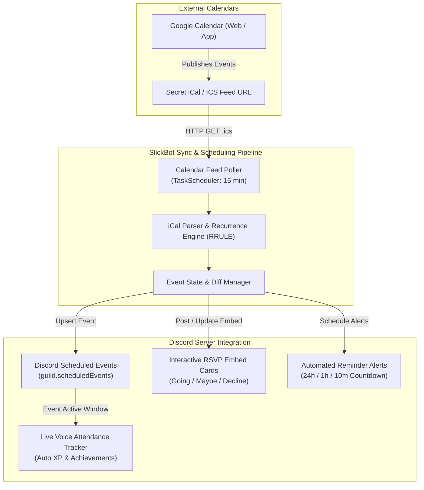
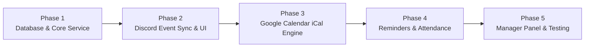

# 📅 Events & Google Calendar Sync Module Implementation Plan

## Executive Summary & Vision

The **Events & Calendar Sync Module (`EVENTS`)** delivers an enterprise-grade community scheduling and attendance tracking engine for SlickBot. It unifies **Discord Scheduled Events**, interactive in-channel **RSVP cards**, automated **pre-event countdown notifications**, and real-time **Google Calendar synchronization**.

With this module, communities can manage events in their existing calendar apps (Google Calendar, Apple Calendar, Outlook) and have SlickBot automatically create, update, and manage matching Discord events, collect RSVPs, and reward active voice attendance.

---

## 🏗️ System Architecture & Workflow



---

## 🌟 Core Feature Capabilities

### 1. Google Calendar Auto-Subscription (iCal / ICS Engine)
* **Zero-Credential Frictionless Setup:** Server admins link their Google Calendar via its standard **Secret Address in iCal format** (`https://calendar.google.com/calendar/ical/.../basic.ics`).
* **Multi-Calendar Support:** Admins can link separate calendars for different event types (e.g. *Community Game Nights*, *Stream Schedule*, *Staff Meetings*).
* **Automated Two-Way Synchronization:**
  - When an event is added or edited in Google Calendar (title, description, start/end time, recurrence), SlickBot detects the change on its background cycle and updates the matching Discord Scheduled Event.
  - When an event is cancelled or deleted from the calendar, SlickBot cleanly cancels or deletes the corresponding Discord event.
* **Smart Channel & Location Routing:**
  - Automatic detection of Voice vs External Stage: If the location field contains a voice channel name (or defaults to the server's event voice hub), SlickBot configures a Voice Channel Scheduled Event.
  - If the location contains an external URL (e.g. Twitch, YouTube, Zoom), SlickBot configures an External Scheduled Event.

---

### 2. Interactive RSVP Cards & Attendance Engine
* **Dynamic Action Component Embeds:**
  - SlickBot posts an interactive event showcase embed with live RSVP buttons:
    - `✅ Going (18)`
    - `🤔 Maybe (7)`
    - `❌ Decline (3)`
    - `👥 View Attendees`
* **Real-Time Button Counters:** Clicking an RSVP button updates the participant count immediately in the embed without rate-limit spam.
* **Attendee List Inspection Modal:** Members and staff can click `👥 View Attendees` to see a categorized, paginated roster of who is attending.

```text
+------------------------------------------------------------------------+
| 📅 COMMUNITY GAME NIGHT: MARIO KART 8 DELUXE                           |
| Host: @SlickPickleNick                                                 |
| 🕒 Time: Friday, August 28, 2026 at 8:00 PM EDT (<t:1787961600:R>)   |
| 📍 Location: 🔊 Community Voice 1                                      |
|                                                                        |
| Join us for 12 rounds of community GP! All skill levels welcome.       |
|                                                                        |
| 📊 RSVPs:                                                              |
| • ✅ Going (14): SlickPickleNick, PicklePro, YoshiFan, ...             |
| • 🤔 Maybe (4): MarioKartFan, Luigi99, ...                            |
|                                                                        |
| [ ✅ Going (14) ]  [ 🤔 Maybe (4) ]  [ ❌ Decline ]  [ 👥 Attendees ]  |
+------------------------------------------------------------------------+
```

---

### 3. Automated Countdown Reminders & Pings
* **Tiered Reminder Intervals:** Configurable reminder notifications dispatched at:
  - **24 Hours Before:** General community reminder in the announcement channel.
  - **1 Hour Before:** Ping reminder mentioning all members who RSVP'd **Going**.
  - **10 Minutes Before / Live Now:** Direct join link mentioning the **Going** role and hopping into the voice channel.
* **Smart User DM Alerts:** Members who RSVP `Going` can opt-in to receive a private DM alert 15 minutes prior to start.

---

### 4. Live Voice Attendance Tracker & XP Rewards
* **Automatic Voice Check-In:** During the active window of a scheduled event, SlickBot monitors the configured voice channel.
* **XP & Coin Grants:** Automatically awards custom Leveling XP and Server Coins to all attendees who stay in the channel for a minimum duration (e.g. 15+ minutes).
* **Achievement Integration:** Automatically increments the `Community Events Attended` and `Community Events Hosted` achievements.

---

## 🗄️ Database Schema Design

```sql
-- Global event system configuration per guild
CREATE TABLE IF NOT EXISTS event_configs (
  guild_id TEXT PRIMARY KEY REFERENCES guild_configs(guild_id) ON DELETE CASCADE,
  enabled BOOLEAN NOT NULL DEFAULT true,
  default_announcement_channel_id TEXT,
  default_voice_channel_id TEXT,
  rsvp_ping_role_id TEXT,
  dm_reminders_enabled BOOLEAN NOT NULL DEFAULT true,
  attendance_xp_reward INTEGER NOT NULL DEFAULT 100,
  attendance_coins_reward INTEGER NOT NULL DEFAULT 50,
  attendance_min_minutes INTEGER NOT NULL DEFAULT 15,
  created_at TIMESTAMPTZ NOT NULL DEFAULT NOW(),
  updated_at TIMESTAMPTZ NOT NULL DEFAULT NOW()
);

-- Calendar feed subscriptions (Google Calendar, Outlook, Apple iCal)
CREATE TABLE IF NOT EXISTS calendar_subscriptions (
  id TEXT PRIMARY KEY DEFAULT gen_random_uuid()::text,
  guild_id TEXT NOT NULL REFERENCES guild_configs(guild_id) ON DELETE CASCADE,
  calendar_name TEXT NOT NULL,
  feed_url TEXT NOT NULL,
  default_channel_id TEXT,
  default_voice_channel_id TEXT,
  sync_frequency_minutes INTEGER NOT NULL DEFAULT 15,
  last_synced_at TIMESTAMPTZ,
  last_sync_status TEXT NOT NULL DEFAULT 'PENDING',
  last_sync_error TEXT,
  auto_post_rsvp BOOLEAN NOT NULL DEFAULT true,
  enabled BOOLEAN NOT NULL DEFAULT true,
  created_by_user_id TEXT,
  created_at TIMESTAMPTZ NOT NULL DEFAULT NOW(),
  updated_at TIMESTAMPTZ NOT NULL DEFAULT NOW()
);

-- Community event records (both manual and calendar-synced)
CREATE TABLE IF NOT EXISTS community_events (
  id TEXT PRIMARY KEY DEFAULT gen_random_uuid()::text,
  guild_id TEXT NOT NULL REFERENCES guild_configs(guild_id) ON DELETE CASCADE,
  calendar_subscription_id TEXT REFERENCES calendar_subscriptions(id) ON DELETE SET NULL,
  external_uid TEXT, -- UID from Google Calendar / iCal
  discord_scheduled_event_id TEXT,
  title TEXT NOT NULL,
  description TEXT,
  location_type TEXT NOT NULL DEFAULT 'VOICE', -- 'VOICE', 'STAGE', 'EXTERNAL'
  location_text TEXT,
  voice_channel_id TEXT,
  announcement_channel_id TEXT,
  rsvp_message_id TEXT,
  start_time TIMESTAMPTZ NOT NULL,
  end_time TIMESTAMPTZ,
  host_user_id TEXT,
  status TEXT NOT NULL DEFAULT 'SCHEDULED', -- 'SCHEDULED', 'ACTIVE', 'COMPLETED', 'CANCELLED'
  reminder_24h_sent BOOLEAN NOT NULL DEFAULT false,
  reminder_1h_sent BOOLEAN NOT NULL DEFAULT false,
  reminder_10m_sent BOOLEAN NOT NULL DEFAULT false,
  created_at TIMESTAMPTZ NOT NULL DEFAULT NOW(),
  updated_at TIMESTAMPTZ NOT NULL DEFAULT NOW(),
  UNIQUE(guild_id, external_uid)
);

-- Member RSVP responses
CREATE TABLE IF NOT EXISTS community_event_rsvps (
  id TEXT PRIMARY KEY DEFAULT gen_random_uuid()::text,
  event_id TEXT NOT NULL REFERENCES community_events(id) ON DELETE CASCADE,
  guild_id TEXT NOT NULL REFERENCES guild_configs(guild_id) ON DELETE CASCADE,
  user_id TEXT NOT NULL,
  user_tag TEXT,
  status TEXT NOT NULL DEFAULT 'GOING', -- 'GOING', 'MAYBE', 'DECLINE'
  dm_reminder_opt_in BOOLEAN NOT NULL DEFAULT true,
  created_at TIMESTAMPTZ NOT NULL DEFAULT NOW(),
  updated_at TIMESTAMPTZ NOT NULL DEFAULT NOW(),
  UNIQUE(event_id, user_id)
);

-- Voice attendance tracking and rewards
CREATE TABLE IF NOT EXISTS event_attendance_logs (
  id TEXT PRIMARY KEY DEFAULT gen_random_uuid()::text,
  event_id TEXT NOT NULL REFERENCES community_events(id) ON DELETE CASCADE,
  guild_id TEXT NOT NULL REFERENCES guild_configs(guild_id) ON DELETE CASCADE,
  user_id TEXT NOT NULL,
  total_minutes_present INTEGER NOT NULL DEFAULT 0,
  reward_granted BOOLEAN NOT NULL DEFAULT false,
  rewarded_xp INTEGER NOT NULL DEFAULT 0,
  rewarded_coins INTEGER NOT NULL DEFAULT 0,
  created_at TIMESTAMPTZ NOT NULL DEFAULT NOW(),
  updated_at TIMESTAMPTZ NOT NULL DEFAULT NOW(),
  UNIQUE(event_id, user_id)
);

CREATE INDEX IF NOT EXISTS idx_community_events_time ON community_events(guild_id, status, start_time);
CREATE INDEX IF NOT EXISTS idx_community_events_discord ON community_events(guild_id, discord_scheduled_event_id);
CREATE INDEX IF NOT EXISTS idx_community_event_rsvps_lookup ON community_event_rsvps(event_id, status);
CREATE INDEX IF NOT EXISTS idx_calendar_subscriptions_sync ON calendar_subscriptions(enabled, last_synced_at);
```

---

## 💻 Slash Command Suite (`/event`)

### Member Commands
* `/event list [filter: upcoming/today/all]`: Browse active and upcoming community events with interactive pagination.
* `/event info [event]`: View detailed event card, location, description, and live RSVP status.
* `/event rsvp [event] status:<going|maybe|decline>`: Submit or change event RSVP status.
* `/event my-events`: View upcoming events you have RSVP'd for.

### Staff & Organizer Commands
* `/event create`: Open the interactive Event Creation Wizard (Title, Description, Time, Voice Channel, Header Image).
* `/event edit [event]`: Edit event time, channel, or details with live Discord event syncing.
* `/event cancel [event] [reason]`: Cancel an event and notify attendees.
* `/event attendees [event]`: View detailed attendee list with export to CSV option.
* `/event post-card [event] [channel]`: Post or repost the interactive RSVP card embed.

### Google Calendar Integration Commands
* `/event calendar link name:<name> url:<ics_url> [announce_channel] [voice_channel]`: Subscribe to a Google Calendar feed.
* `/event calendar sync [name]`: Manually trigger an immediate synchronization run.
* `/event calendar list`: View all connected calendar feeds and last sync status.
* `/event calendar edit [name]`: Modify connected calendar settings.
* `/event calendar disconnect [name]`: Disconnect a calendar subscription.

---

## 🛠️ Step-by-Step Implementation Roadmap



### Phase 1: Database Foundation & Core Event Service
1. **Database Migrations:**
   - Add schema definitions in `src/services/initDatabase.js` for `event_configs`, `calendar_subscriptions`, `community_events`, `community_event_rsvps`, and `event_attendance_logs`.
2. **Event Service Layer (`src/modules/community/eventService.js`):**
   - Implement `createEvent`, `updateEvent`, `cancelEvent`, `getEvent`, `listEvents`.
   - Implement `submitRsvp`, `getEventRsvps`, `getAttendeeCounts`.
3. **Module Registry & Permissions:**
   - Register `ModuleKeys.EVENTS` in `src/modules/moduleRegistry.js` under `COMMUNITY`.
   - Add ActionKeys (`EVENT_CREATE`, `EVENT_MANAGE`, `EVENT_CALENDAR_MANAGE`, `EVENT_RSVP`).

---

### Phase 2: Discord Scheduled Events & Interactive RSVP UI
1. **Discord API Integration:**
   - Implement native Discord event bridge:
     ```javascript
     guild.scheduledEvents.create({
       name: event.title,
       scheduledStartTime: event.start_time,
       scheduledEndTime: event.end_time,
       privacyLevel: GuildScheduledEventPrivacyLevel.GuildOnly,
       entityType: event.voice_channel_id ? GuildScheduledEventEntityType.Voice : GuildScheduledEventEntityType.External,
       channel: event.voice_channel_id || undefined,
       entityMetadata: !event.voice_channel_id ? { location: event.location_text } : undefined,
       description: event.description
     });
     ```
2. **Interactive UI Components (`src/modules/community/eventUi.js`):**
   - Build `buildEventCardEmbed(event, rsvpCounts)`.
   - Build `buildEventActionRow(eventId)` with `Going`, `Maybe`, `Decline`, `Attendees` buttons.
   - Build `buildAttendeesModal(event, rsvps)`.
3. **Interaction Handlers:**
   - Route button IDs (`CustomIds.EVENT_RSVP_GOING`, `CustomIds.EVENT_RSVP_MAYBE`, etc.) in `interactionRouter.js`.

---

### Phase 3: Google Calendar / iCal Synchronization Engine
1. **iCal Feed Parser:**
   - Add lightweight `node-ical` package to parse `.ics` streams from Google Calendar.
   - Handle timezones, UTC conversions, and recurring events (`rrule`).
2. **Diff & Upsert Engine (`src/modules/community/calendarSyncService.js`):**
   - Fetch `.ics` feed -> iterate VEVENT records -> match against `community_events.external_uid`.
   - Detect changes: Update Discord event if title, time, or description changed.
   - Detect deletions: Cancel Discord event if deleted from Google Calendar.
3. **TaskScheduler Runner:**
   - Register `taskScheduler.registerTask('calendar-sync-runner', 15 * 60 * 1000, runCalendarSyncTask)`.

---

### Phase 4: Automated Reminders & Live Attendance Tracking
1. **Background Reminder Engine:**
   - Register `taskScheduler.registerTask('event-reminder-runner', 60 * 1000, checkDueEventReminders)`.
   - Dispatch 24-hour, 1-hour, and 10-minute alerts with dynamic countdown timestamps (`<t:...:R>`).
   - Send opt-in DM alerts to confirmed attendees.
2. **Voice Attendance Monitor:**
   - When event status is `ACTIVE`, track members present in the linked voice channel every 5 minutes.
   - Upon event completion (`COMPLETED`), award `attendance_xp_reward` and `attendance_coins_reward` to eligible members and record in `achievement_progress`.

---

### Phase 5: Interactive Setup Wizard, Manager Panel & Testing
1. **Interactive Setup Wizard:**
   - `/event setup` guided wizard for default announcement channel, default voice channel, and XP reward values.
2. **Event Manager Dashboard:**
   - `/event manager` with live calendar connection badges, active events count, and feature toggles.
3. **Test Suite & Diagnostics:**
   - Unit tests for iCal parsing, event creation, RSVP toggles, and attendance awarding.
   - Diagnostics in `/bot test` verifying table integrity and Google Calendar parser readiness.

---

## 🔒 Google Calendar Setup Instructions for Users

1. Open **Google Calendar** on desktop ([calendar.google.com](https://calendar.google.com)).
2. On the left sidebar under *My calendars*, hover over your calendar -> click **Settings and sharing**.
3. Scroll down to the section named **Integrate calendar**.
4. Copy the URL labeled **Secret address in iCal format** (`https://calendar.google.com/calendar/ical/.../basic.ics`).
5. In Discord, run:
   ```text
   /event calendar link name:"Community Events" url:"https://calendar.google.com/calendar/ical/.../basic.ics"
   ```
6. SlickBot will immediately validate the feed, perform an initial sync, and post upcoming events!

---

*Related Documentation:*
* [SlickBot Development Roadmap](./DEVELOPMENT_ROADMAP.md) — Flagship development and module roadmap.
* [Streamer.bot Integration Guide](./STREAMERBOT_DEVELOPMENT.md) — Streamer.bot and Twitch livestreaming integration.
