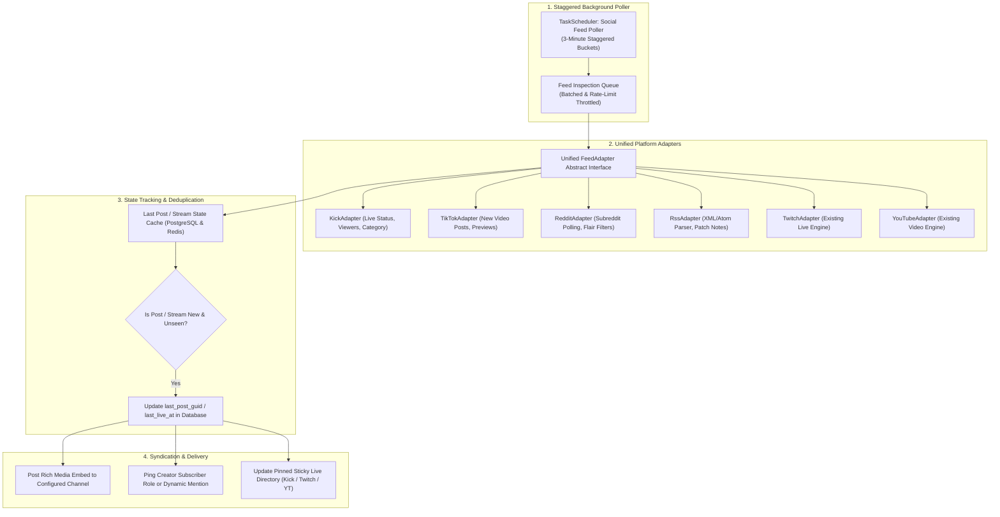
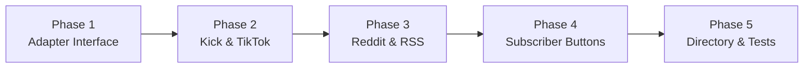

# 📡 Expanded Social Feeds & Webhook Hub Module Plan

## Executive Summary & Vision

The **Expanded Social Feeds & Webhook Hub Module (`SOCIAL_EXPANSION`)** transforms SlickBot from a standard Twitch/YouTube notifier into a universal, multi-platform content aggregator.

Modern creators and communities operate across diverse platforms. This module introduces robust, rate-limit resilient adapters for **Kick.com Live Streams**, **TikTok Creator Uploads**, **Reddit Subreddit Monitors**, and **Custom RSS / Atom & Webhook Feeds** (Game Patch Notes, Medium, Steam, GitHub).

All live streaming platforms (Twitch, YouTube, Kick) automatically syndicate into SlickBot's pinned **Live Stream Sticky Directory**, while members can toggle self-service role alerts per creator with a single click (`🔔 Get Alerts`).

---

## 🏗️ System Architecture & Workflow



---

## 🌟 Core Feature Capabilities

### 1. Kick.com Live Stream Tracking
* **Real-Time Stream Detection:**
  - Tracks streamer live status, stream category/game, stream title, and current viewer count.
* **Rich Visual Embeds:**
  - High-res dynamic stream preview thumbnail, Kick channel avatar, and instant direct watch button.
* **Live Directory Hub Synergy:**
  - Kick streams automatically syndicate into the server's pinned auto-updating **Live Stream Sticky Directory** alongside Twitch and YouTube creators.

```text
+------------------------------------------------------------------------+
| 🟢 SLICKPICKLENICK IS NOW LIVE ON KICK!                                |
| https://kick.com/slickpicklenick                                       |
|                                                                        |
| 🎮 Playing: MARIO KART 8 DELUXE                                        |
| 👥 Viewers: 142 | 🕒 Started: <t:1787961600:R>                         |
|                                                                        |
| "Community GP Night + Viewer Battles! Hop in chat!"                    |
| [ 🖼️ Dynamic Stream Preview Thumbnail ]                               |
|                                                                        |
| [ 📺 Watch on Kick ]   [ 🔔 Get Alerts ]                               |
+------------------------------------------------------------------------+
```

---

### 2. TikTok Creator Alerts
* **Instant Upload Notifications:**
  - Detects newly uploaded TikTok videos from tracked creator profiles.
* **Rich Preview Formatting:**
  - Extracts video description, hashtags, cover thumbnail, and direct mobile-friendly URL.

---

### 3. Reddit Subreddit Monitor
* **Flexible Subreddit Tracking:**
  - Monitor any public subreddit (e.g. `r/discordapp`, `r/gaming`, `r/pcmasterrace`) for new posts or hot threads.
* **Content Filtering & Safety:**
  - Filter by minimum upvote thresholds, post flairs (e.g. only `News` or `Patch Notes`), and automatic spoiler/NSFW blur protection.
* **Image & Gallery Unfurling:**
  - Directly unfurls Reddit image uploads and video thumbnails into Discord embeds.

---

### 4. Universal RSS / Atom & Game Patch Notes Hub
* **Universal Feed Compatibility:**
  - Follow game update blogs (Valorant, Fortnite, Steam updates, Minecraft), Medium publications, news outlets, or GitHub repository releases.
* **Clean Text Sanitization:**
  - Strips messy HTML tags and converts article summaries into formatted markdown with clickable headers.

---

### 5. Self-Service Creator Subscriptions (`🔔 Get Alerts`)
* **Interactive Per-Creator Roles:**
  - Every alert post includes an interactive `[ 🔔 Get Alerts ]` button.
  - Members can click the button to toggle notifications for that specific creator without needing `@everyone` or `@here` server-wide pings.

---

## 🗄️ Database Schema Design

```sql
-- Extended social feed configurations
ALTER TABLE social_feeds ADD COLUMN IF NOT EXISTS rss_feed_url TEXT;
ALTER TABLE social_feeds ADD COLUMN IF NOT EXISTS reddit_subreddit TEXT;
ALTER TABLE social_feeds ADD COLUMN IF NOT EXISTS reddit_min_upvotes INTEGER NOT NULL DEFAULT 0;
ALTER TABLE social_feeds ADD COLUMN IF NOT EXISTS reddit_flair_filter TEXT;
ALTER TABLE social_feeds ADD COLUMN IF NOT EXISTS custom_template_message TEXT;
ALTER TABLE social_feeds ADD COLUMN IF NOT EXISTS include_in_live_hub BOOLEAN NOT NULL DEFAULT true;
ALTER TABLE social_feeds ADD COLUMN IF NOT EXISTS last_post_guid TEXT;
ALTER TABLE social_feeds ADD COLUMN IF NOT EXISTS last_post_timestamp TIMESTAMPTZ;
ALTER TABLE social_feeds ADD COLUMN IF NOT EXISTS subscriber_role_id TEXT;

-- Per-creator subscriber tracker for self-service alerts
CREATE TABLE IF NOT EXISTS social_feed_subscribers (
  id TEXT PRIMARY KEY DEFAULT gen_random_uuid()::text,
  guild_id TEXT NOT NULL REFERENCES guild_configs(guild_id) ON DELETE CASCADE,
  feed_id TEXT NOT NULL REFERENCES social_feeds(id) ON DELETE CASCADE,
  user_id TEXT NOT NULL,
  created_at TIMESTAMPTZ NOT NULL DEFAULT NOW(),
  UNIQUE(feed_id, user_id)
);

CREATE INDEX IF NOT EXISTS idx_social_feeds_platform ON social_feeds(guild_id, platform, enabled);
CREATE INDEX IF NOT EXISTS idx_social_feed_subs ON social_feed_subscribers(feed_id, user_id);
```

---

## 💻 Slash Command Suite (`/feed`)

### Managing Feeds:
* `/feed add`:
  - `platform: <kick | tiktok | reddit | rss | twitch | youtube>`
  - `channel: <#channel>` (Discord channel to post alerts)
  - `target: <username | subreddit | rss_url>`
  - `ping_role: <@role>` (Optional role to mention)
  - `custom_message: <text>` (Custom announcement caption with variables like `{author}`, `{title}`, `{url}`)
* `/feed list [platform]`:
  - Browse all active social subscriptions and their target channels.
* `/feed edit [feed_id]`:
  - Modify announcement channel, ping role, or custom message template.
* `/feed remove [feed_id]`:
  - Disconnect and delete a social feed subscription.
* `/feed test [feed_id]`:
  - Dispatches a test embed to verify channel permissions and formatting.

### Live Directory Hub:
* `/feed directory post [channel]`:
  - Post or refresh the pinned auto-updating Live Stream Directory showcase embed.

---

## 🛠️ Step-by-Step Implementation Roadmap



### Phase 1: Unified FeedAdapter Architecture
1. **Abstract Base Class (`src/modules/socialFeeds/adapters/feedAdapter.js`):**
   - Define interface methods: `checkFeed(target)`, `formatEmbed(item)`, `isLive(target)`.
2. **Database Extensions (`src/services/initDatabase.js`):**
   - Apply columns for `rss_feed_url`, `reddit_subreddit`, and `social_feed_subscribers`.

### Phase 2: Kick.com & TikTok Adapters
1. **Kick.com Adapter (`src/modules/socialFeeds/adapters/kickAdapter.js`):**
   - Implement Kick public API poller with fallback scraping parser.
2. **TikTok Adapter (`src/modules/socialFeeds/adapters/tiktokAdapter.js`):**
   - Implement video upload detector and metadata extractor.

### Phase 3: Reddit & Universal RSS Adapters
1. **Reddit Adapter (`src/modules/socialFeeds/adapters/redditAdapter.js`):**
   - Implement JSON Reddit endpoint poller with upvote and flair filters.
2. **RSS / Atom Parser (`src/modules/socialFeeds/adapters/rssAdapter.js`):**
   - Implement XML/Atom feed parser with HTML-to-markdown text sanitizer.

### Phase 4: Self-Service `🔔 Get Alerts` Subscriptions
1. **Interactive Button Handler (`src/services/interactionRouter.js`):**
   - Handle clicks on `CustomIds.FeedSubscribePrefix`.
   - Add/remove member from `social_feed_subscribers` and assign/remove creator notification role.

### Phase 5: Live Directory Synergy & Automated Tests
1. **Live Directory Hub Sync:**
   - Ensure Kick live streams automatically appear on the sticky live directory alongside Twitch and YouTube.
2. **Automated Unit Testing (`test/unit/expandedFeeds.test.js`):**
   - Test adapter parsers, state deduplication, RSS XML parsing, and subscription toggle mechanics.

---

## 🔒 Rate-Limiting, Scraper Resilience & Performance

1. **Staggered Polling Buckets:**
   - Feeds are divided into 3-minute rotational buckets in `TaskScheduler` to prevent hitting external rate limits.
2. **Graceful Error Handling & Circuit Breakers:**
   - If an external platform experiences an outage (e.g. Kick 502 or TikTok rate limit), SlickBot logs a silent warning and applies an exponential backoff retry rather than crashing.
3. **Embed Caching:**
   - Post GUIDs and stream start times are cached in PostgreSQL to guarantee zero duplicate announcements.
