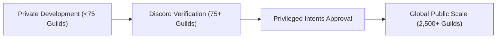

# SlickBot Multi-Server Expansion Roadmap

## Overview & Vision

SlickBot was initially architected as an all-in-one Discord server management bot for the **SlickPickleNick** community. From its foundation, SlickBot was built with modular services, strict database-backed multi-tenancy, granular role-based permissions, and interactive in-Discord setup panels.

This roadmap outlines the technical architecture, infrastructure milestones, and product vision required to transition SlickBot from a private, single-server instance into a scalable, multi-tenant Discord bot capable of serving hundreds or thousands of external communities.

---

## 1. 🏗️ Multi-Tenancy Architecture & Current State

SlickBot already features strong multi-tenancy foundations:

* **Database Partitioning:** PostgreSQL schema tables (`guild_configs`, `bot_update_configs`, `utility_configs`, `level_users`, `ticket_configs`, `giveaway_records`, `social_feeds`, etc.) partition all settings, records, and history strictly by `guild_id`.
* **In-Discord Setup Center (`/setup`):** The interactive configuration hub, module managers, and permission matrices operate purely on the context of the requesting guild (`interaction.guildId`).
* **Scoped Caching:** In-memory caches for role panels, permissions, and snipe history are indexed per guild, preventing cross-server data leakage.

### Upcoming Architecture Polish:
* **Lifecycle Event Handlers:**
  - `guildCreate`: Automatically seed default guild configs, send an interactive welcome/setup guide to the system channel or server owner, and initialize default permission teams.
  - `guildDelete`: Pause scheduled background jobs and cleanly handle data archival or retention policies.
* **Global Slash Command Deployment:**
  - Transition `src/deployCommands.js` to register commands globally with Discord's API (`Routes.applicationCommands(clientId)`), ensuring immediate availability across all joined servers.

---

## 2. 🛡️ Bot Verification & Discord Compliance

When expanding to public servers, Discord enforces specific developer and verification standards:

* **75+ Server Milestone (Discord Verification):**
  - Verify developer identity / organization via Discord Developer Portal.
  - Establish and host public **Terms of Service (ToS)** and **Privacy Policy** documents.
* **Privileged Gateway Intents Approval:**
  - Submit intent verification requests for `GuildMembers` (required for auto-roles, welcome banners, role panels) and `MessageContent` (required for auto-mod, chat leveling XP, and custom trigger commands).
* **Data Privacy & Retention:**
  - Provide server owners with automated data reset and export capabilities (`/reset`, `/utility reset`, etc.).

---

## 3. 🚀 Infrastructure & Performance Scaling

As the number of concurrent guilds and members grows, infrastructure needs to scale smoothly:

### A. WebSocket Sharding (`ShardingManager`)
* Under **2,500 servers**, a single Node.js process manages Discord gateway WebSocket connections comfortably.
* Beyond **2,500 servers**, Discord requires splitting WebSocket connections across distinct shards.
* Implement `discord.js` `ShardingManager` to spawn worker processes across CPU cores.

### B. Database Optimization & Connection Pooling
* Maintain PostgreSQL connection pooling (`pg.Pool`) with connection limits tuned for container hosting.
* Ensure comprehensive database indexing on all foreign keys (`guild_id`, `user_id`, `created_at`, `status`).
* Implement an optional Redis layer for high-throughput caching (e.g. active voice XP sessions, snipe caches, rate-limit counters).

### C. Background Task Management
* The centralized `TaskScheduler` (`src/services/taskScheduler.js`) provides concurrency locking and staggered execution to ensure background tasks (feed polling, reminders, giveaways, temp-roles) scale predictably without CPU spikes.

---

## 4. 🖥️ Web Management Dashboard

While the in-Discord `/setup` center provides immediate, zero-friction configuration for moderators on mobile and desktop, a companion **Web Dashboard** provides an enhanced experience for complex server management:

* **Authentication:** Secure Discord OAuth2 login with guild permission verification (`Administrator` / `ManageGuild`).
* **Advanced Configuration Hubs:**
  - Visual embed builder and announcement scheduler with rich live previews.
  - Drag-and-drop Reaction Role and Role Panel builder.
  - Custom command library editor with JSON/variable syntax highlighting.
  - Ticket and support intake form builder with reorderable question fields.
* **Analytics & Insights:**
  - Server activity graphs (messages per hour, voice channel hours).
  - Member retention and referral conversion funnels.
  - Moderation case trends and audit log search.

---

## 5. ⚙️ Resource Quotas & Feature Management

To maintain system stability, fair compute allocation, and protect hosting infrastructure across high-traffic communities, the bot architecture may introduce configurable resource quotas in future revisions:

> [!NOTE]
> Resource allocation rules and limits may be introduced as the platform scales to ensure optimal performance for all participating servers.

* **Potential Resource Allocation Areas:**
  - Maximum concurrent social feeds per server (e.g. YouTube/Twitch polling limits).
  - Maximum active giveaways and scheduled cron messages.
  - High-frequency voice XP analytics and audio activity tracking.
  - Custom command limits and automated sticky message channels.

---

## 6. 📈 Phased Rollout Plan

| Phase | Focus Area | Key Deliverables |
| :--- | :--- | :--- |
| **Phase 1** | **Multi-Server Polish** | Global command deployment, `guildCreate`/`guildDelete` handlers, privacy & data retention audit. |
| **Phase 2** | **Pilot Expansion** | Invite bot to selected partner/test servers; stress-test concurrent background tasks and multi-guild permissions. |
| **Phase 3** | **Discord Verification** | Public ToS & Privacy Policy, submit Discord Bot Verification and Privileged Intent reviews (at 75+ guilds). |
| **Phase 4** | **Web Dashboard** | Next.js/React web portal with Discord OAuth2 for desktop configuration and server analytics. |
| **Phase 5** | **Public Launch & Sharding** | Implement `ShardingManager`, list on bot discovery platforms, and scale container compute as adoption expands. |
