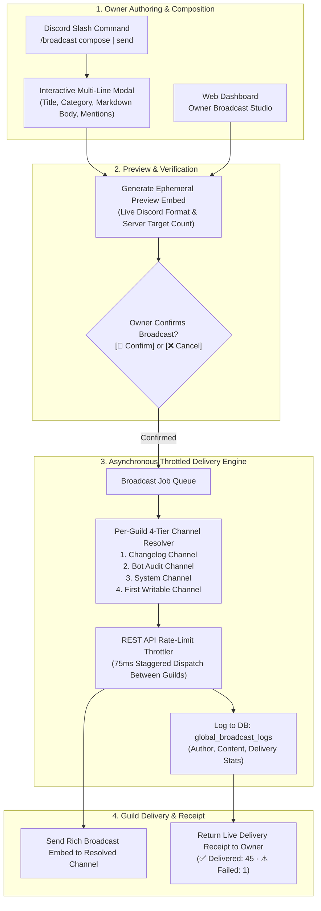

# 📢 Global Broadcast & Owner Announcement System Plan

## Executive Summary & Vision

The **Global Broadcast & Owner Announcement System (`GLOBAL_BROADCAST`)** empowers the bot owner and global administrators to broadcast official announcements, terms of service updates, critical maintenance notices, and major feature rollouts directly to all connected Discord servers running SlickBot.

This system provides:
1. **Multi-Channel Dispatch Interfaces**: Craft announcements through an interactive Discord command workflow (`/broadcast`) with multi-line modals, or via a rich **Owner Broadcast Studio** on the Web Dashboard with real-time preview rendering.
2. **Intelligent Channel Resolution**: Automatically routes messages to the most appropriate channel in each server (e.g. dedicated changelog channels, bot audit logs, or Discord system channels).
3. **Safety, Previews & Rate Limiting**: Features a compulsory two-step preview & confirmation workflow to prevent accidental broadcasts, paired with an asynchronous throttler to safely adhere to Discord REST API rate limits across hundreds of guilds.
4. **Permanent Audit & Delivery Tracking**: Logs every broadcast into PostgreSQL with recipient server counts, delivery timestamps, failure diagnostics, and author attribution.

---

## 🏗️ System Architecture & Workflow



---

## 🎯 Channel Resolution Strategy

When a broadcast is dispatched, SlickBot resolves the optimal target channel for each guild using a prioritized fallback cascade:

```mermaid
flowchart TD
    Start([Evaluate Guild]) --> CheckChangelog{1. Has Dedicated Changelog Channel?<br/>guild_configs.default_log_channel_id}
    CheckChangelog -->|Yes & Writable| SendChangelog[Deliver to Changelog Channel]
    CheckChangelog -->|No or No Perms| CheckAudit{2. Has Bot Config Audit Channel?<br/>guild_configs.config_audit_channel_id}
    
    CheckAudit -->|Yes & Writable| SendAudit[Deliver to Bot Audit Channel]
    CheckAudit -->|No or No Perms| CheckSystem{3. Has Discord System Channel?<br/>guild.systemChannel}
    
    CheckSystem -->|Yes & Writable| SendSystem[Deliver to System Channel]
    CheckSystem -->|No or No Perms| CheckFallback{4. First Writable Text Channel?<br/>(Excludes Voice, Tickets, Quarantine)}
    
    CheckFallback -->|Found| SendFallback[Deliver to General Text Channel]
    CheckFallback -->|None Found| SkipGuild[Record Guild as Skipped / No Permissions]
```

### Channel Selection Priority Table
| Priority | Channel Type | Source Identifier | Ideal Purpose |
| :--- | :--- | :--- | :--- |
| **Tier 1 (Highest)** | Dedicated Server Changelog | `guild_configs.default_log_channel_id` | Purpose-built for bot release logs and announcements. |
| **Tier 2** | Bot Configuration Audit Channel | `guild_configs.config_audit_channel_id` | Server administrator-facing bot feed. |
| **Tier 3** | Discord Default System Channel | `guild.systemChannel` | Standard Discord community update channel. |
| **Tier 4** | Primary Public Text Channel | First channel with `SendMessages` & `EmbedLinks` | General public server communication. |
| **Fallback** | Skipped / Failure Metric | N/A | Guild is recorded as failed without stopping the job. |

---

## 💻 Dispatch Interfaces

### 1. Discord Slash Commands (`/broadcast`)

Restricted exclusively to bot owners via `permissions.isBotOwner(interaction.user.id)`.

* **`/broadcast compose`**:
  * Opens a Discord text input modal:
    * `title`: Announcement Title (e.g., *"Terms of Service & Privacy Policy Update"*).
    * `category`: Broadcast Category (`ANNOUNCEMENT`, `TERMS_UPDATE`, `FEATURE_ROLLOUT`, `MAINTENANCE`).
    * `message`: Long-form Markdown body text with support for bullet points, bolding, and links.
    * `ping`: Mention mode (`None`, `@everyone`, `@here`).
* **`/broadcast send`**:
  * Direct command with options for rapid, single-line dispatches.
* **`/broadcast preview`**:
  * Displays an ephemeral mock-up of how the embed will look in recipient channels.
* **`/broadcast history`**:
  * Displays a paginated summary of previous broadcasts, timestamps, delivery rates, and author tags.

---

### 2. Web Dashboard Owner Studio

A dedicated **"Global Broadcast Studio"** tab on the SlickBot Web Dashboard:
* **Interactive Live Preview**: Real-time rendering of the Discord embed while typing.
* **Category Badges**:
  * 📢 **Official Announcement** (`#3B82F6` - Blue)
  * 📜 **Terms & Privacy Update** (`#EAB308` - Amber)
  * 🚀 **New Features & Rollout** (`#10B981` - Green)
  * 🛠️ **Maintenance & Downtime** (`#EF4444` - Red)
* **Delivery Metrics Dashboard**: Real-time progress bar displaying guilds reached, percentage completion, and live error log.

---

## 🗄️ Database Schema Design

```sql
-- Global Broadcast Audit History
CREATE TABLE IF NOT EXISTS global_broadcast_logs (
    id SERIAL PRIMARY KEY,
    broadcast_id VARCHAR(64) UNIQUE NOT NULL,
    author_id VARCHAR(32) NOT NULL,
    author_tag VARCHAR(64) NOT NULL,
    category VARCHAR(32) NOT NULL DEFAULT 'ANNOUNCEMENT',
    title VARCHAR(256) NOT NULL,
    message_content TEXT NOT NULL,
    ping_type VARCHAR(16) NOT NULL DEFAULT 'NONE',
    embed_color VARCHAR(16) DEFAULT '#3B82F6',
    target_guild_count INTEGER NOT NULL DEFAULT 0,
    delivered_count INTEGER NOT NULL DEFAULT 0,
    failed_count INTEGER NOT NULL DEFAULT 0,
    delivery_report JSONB NOT NULL DEFAULT '[]'::jsonb,
    created_at TIMESTAMP WITH TIME ZONE DEFAULT NOW()
);

CREATE INDEX IF NOT EXISTS idx_broadcast_logs_created ON global_broadcast_logs(created_at DESC);
CREATE INDEX IF NOT EXISTS idx_broadcast_logs_author ON global_broadcast_logs(author_id);
```

---

## 🛡️ Safety & Rate Limiting Controls

1. **Two-Phase Commit (Preview & Confirmation)**:
   - Accidental dispatches are prevented by requiring explicit button confirmation on an ephemeral preview message before sending.
2. **Asynchronous Throttling (75ms Delay)**:
   - Discord's REST API enforces a global rate limit of 50 requests per second per route. Dispatches stagger messages by 75ms–100ms, ensuring 100% compliance without 429 rate limit errors.
3. **Graceful Error Isolation**:
   - Guilds that kick the bot, delete permissions, or restrict channel access fail silently and are appended to the `delivery_report` JSONB summary without crashing or halting the queue.

---

## 📋 Implementation Checklist

- [ ] **Database Migration**: Add `global_broadcast_logs` table in `src/services/initDatabase.js`.
- [ ] **Broadcast Service**: Implement `src/modules/system/broadcastService.js` with channel resolution, formatting, throttler, and database persistence.
- [ ] **Discord Command**: Add `src/commands/broadcast.js` supporting `/broadcast compose`, `/broadcast send`, `/broadcast preview`, and `/broadcast history`.
- [ ] **Interactive Modals & Buttons**: Wire modal submission handler and confirmation buttons in `src/services/interactionRouter.js`.
- [ ] **Web Dashboard Studio**: Add Owner Broadcast console tab and REST API endpoints (`POST /api/owner/broadcast`, `GET /api/owner/broadcasts`) in `dashboard/server.js`.
- [ ] **Unit Testing**: Add test suite in `test/unit/broadcastService.test.js` validating channel resolution cascades, rate-limiting queue, and security permissions.
