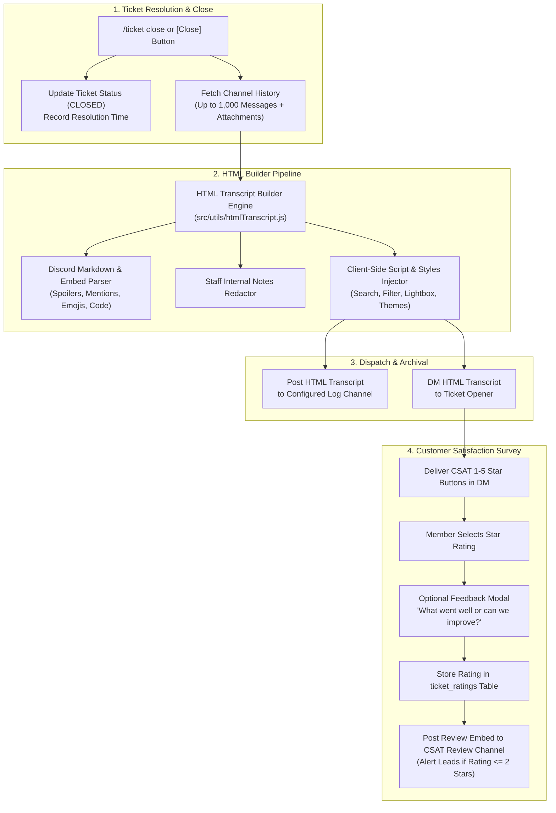
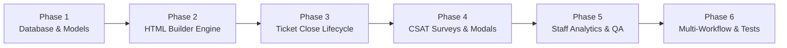

# 🎟️ Interactive HTML Transcripts & Customer Satisfaction (CSAT) Ratings Module Plan

## Executive Summary & Vision

The **Interactive HTML Transcripts & Satisfaction Ratings Module (`TICKETS_PRO`)** elevates SlickBot's customer support workflows from basic plain-text `.txt` logs to enterprise-grade, standalone, Discord-styled **Interactive HTML Transcripts** paired with an automated **Customer Satisfaction (CSAT) Survey & Quality Assurance (QA) Engine**.

Support tickets, staff applications, user reports, and punishment appeals are critical touchpoints for community trust. This module empowers server administrators and staff teams with:
1. **Self-Contained Interactive HTML Transcripts:** Beautiful, responsive HTML files that mirror Discord's modern UI with zero external dependencies. Features client-side live message search, user filter dropdowns, image lightbox galleries, spoiler toggles, and internal staff notes.
2. **Customer Satisfaction (CSAT) Engine:** Automated post-close DM surveys delivering 1–5 Star interactive rating buttons (`⭐ 1 - Very Dissatisfied` to `⭐⭐⭐⭐⭐ 5 - Highly Satisfied`) with optional feedback text modals.
3. **Staff Quality Assurance & Performance Analytics:** Dedicated CSAT review feeds, automatic alerts for negative ratings, and aggregated moderator metrics (average rating, first response time, total tickets handled).

---

## 🏗️ System Architecture & Workflow



---

## 🌟 Core Feature Capabilities

### 1. Standalone Interactive HTML Transcript Engine (`src/utils/htmlTranscript.js`)
* **Zero External Dependencies:** Built as a single self-contained HTML file with embedded CSS, SVGs, and vanilla JavaScript so it opens instantly offline in any web browser without CDN latency or tracking.
* **Pixel-Perfect Discord Styling:**
  - Dark Theme by default, with a one-click toggle to Light Theme or high-contrast AMOLED.
  - Avatars with role badges, staff bot tags, timestamps with Discord relative formatting (`<t:ts:R>`), and user color accents.
* **Comprehensive Discord Markdown Support:**
  - Standard formatting: `**bold**`, `*italic*`, `__underline__`, `~~strikethrough~~`, `-# subtext`.
  - Spoilers: `||hidden text||` rendered as clickable blur elements.
  - Code Blocks: Single-line `` `code` `` and multi-line ```` ```js ... ``` ```` blocks with syntax styling.
  - Blockquotes: `> quote` single-line and `>>> multi-line` blockquotes.
  - Mentions: User (`@Username`), Channel (`#channel-name`), and Role (`@Role`) rendered as highlighted chips.
  - Emojis: Full resolution Discord custom emojis (`<:name:id>`) and animated emojis (`<a:name:id>`).
* **Rich Embeds & Multi-Media Rendering:**
  - Embed author icon, colored sidebar borders, title links, descriptions, inline/stacked field grids, thumbnails, and footers.
  - Native image previews with a built-in **Image Lightbox** (click to zoom/expand full screen).
  - Video and audio attachment playback cards.
  - File download chips with file names, file extensions, and byte sizes for arbitrary attachments.
* **Client-Side Interactive Toolkit:**
  - 🔍 **Live Search Bar:** Instant client-side message search with highlighted query matches.
  - 👤 **Participant Filter:** Dropdown to isolate messages from specific users or staff members.
  - 🖼️ **Media Gallery Tab:** Dedicated view listing all attachments and images shared in the ticket.
  - 📝 **Internal Staff Notes Toggle:** Allows staff viewing the log file to show/hide internal notes.
  - 🖨️ **Print & PDF Optimization:** CSS print media queries for clean one-click PDF exports.

```text
+-------------------------------------------------------------------------------------------------+
| 🎟️ TICKET #1042: Billing Inquiry - Nitro Boost Help                      [ 🔍 Search ] [ 🌓 ]   |
| Opener: @SlickGamer (ID: 2948...) | Closed By: @ModNick | Created: Aug 24, 2026 | Duration: 18m  |
+-------------------------------------------------------------------------------------------------+
| [ All Messages ]  [ 🖼️ Media Gallery (4) ]  [ 📝 Staff Notes (2) ]  [ 👥 Participants (3) ]     |
+-------------------------------------------------------------------------------------------------+
|  @SlickGamer  [Today at 2:14 PM]                                                                |
|  Hey team, I purchased 2 server boosts but didn't receive the VIP role in the Discord server.   |
|  [ 📎 Attachment: receipt_screenshot.png (142 KB) - Click to View ]                             |
+-------------------------------------------------------------------------------------------------+
|  @ModNick  [STAFF] [Today at 2:18 PM]                                                           |
|  Checking on this for you right now! Let me verify your transaction ID in the Stripe logs.     |
+-------------------------------------------------------------------------------------------------+
|  🔒 INTERNAL STAFF NOTE by @ModNick [Today at 2:19 PM]                                         |
|  Verified transaction TX_9812984. Stripe webhook was delayed by 3 minutes. Role granted.        |
+-------------------------------------------------------------------------------------------------+
```

---

### 2. Customer Satisfaction Survey (CSAT) Engine
* **Automated Post-Close Delivery:**
  - When a ticket is closed, SlickBot dispatches a private DM to the ticket opener containing the HTML transcript and an interactive CSAT rating prompt.
* **1–5 Star Rating Component:**
  - `⭐ 1 - Very Poor`
  - `⭐⭐ 2 - Poor`
  - `⭐⭐⭐ 3 - Average`
  - `⭐⭐⭐⭐ 4 - Good`
  - `⭐⭐⭐⭐⭐ 5 - Excellent`
* **Optional Qualitative Feedback Modal:**
  - Clicking any star button records the score immediately and opens an optional Discord Modal:
    - Field 1: *What did our team do well, or what could we improve? (Optional, max 1,000 chars)*
* **DM Fallback & Safety Controls:**
  - If a member has server DMs blocked, SlickBot logs a silent fallback notice in the ticket audit logs without crashing.
  - Only the original ticket opener can submit a rating (prevents unauthorized staff self-rating).
  - Single-submission guarantee with configurable rating expiration (default 48 hours).

---

### 3. Staff Quality Assurance & Performance Analytics
* **Dedicated CSAT Review Log Channel:**
  - Posts completed satisfaction reviews with star rating visualizations, resolution duration, assigned staff mentions, and direct quotes of user feedback.
* **Automatic Low-Rating Alert System:**
  - Any survey submitted with `<= 2 Stars` triggers an immediate alert embed pinging the configured Support Supervisor Role (`csat_alert_role_id`) for prompt service recovery.
* **Staff Performance Metrics:**
  - **CSAT Average:** 1.00 to 5.00 average score per staff member and server-wide.
  - **First Response Time (FRT):** Average time between ticket creation and the first staff reply.
  - **Average Resolution Time (ART):** Time between ticket creation and ticket closure.
  - **Volume Handled:** Number of tickets claimed, escalated, and closed.

```text
+------------------------------------------------------------------------+
| 🌟 NEW CSAT RATING RECEIVED - TICKET #1042                             |
|                                                                        |
| Rating: ⭐⭐⭐⭐⭐ (5 / 5 - Excellent)                                   |
| Ticket: #1042 (Billing Inquiry)                                        |
| Opener: @SlickGamer (29481...)                                         |
| Handled By: @ModNick                                                   |
| Resolution Time: 18 minutes (First Response: 4 minutes)                |
|                                                                        |
| 💬 Member Feedback:                                                    |
| "ModNick solved my missing role within minutes! Super fast and polite."|
|                                                                        |
| Submitted on Aug 26, 2026 at 10:14 PM EDT                              |
+------------------------------------------------------------------------+
```

---

### 4. Internal Staff Notes & Annotations
* **Staff-Only Notes (`/ticket note add`):** Staff can attach contextual internal notes to open tickets without alerting the user.
* **Redaction Controls:**
  - Transcripts sent to the public log channel or staff panel contain internal notes.
  - Transcripts sent to the user via DM have internal notes cleanly redacted to protect internal moderator discussions.

---

### 5. Multi-Workflow Support (Applications, Appeals & Reports)
* **Applications & Forms (`APPLICATIONS`):** Generates structured HTML transcripts displaying questions, applicant responses, review history, and staff voting logs.
* **Punishment Appeals (`APPEALS`):** Generates evidence-rich HTML transcripts containing original moderation case details, appellant explanations, and staff decision notes.
* **User & Message Reports (`REPORTS`):** Generates HTML transcripts capturing reported messages, target user history, reporter details, and reviewer resolution notes.

---

## 🗄️ Database Schema Design

```sql
-- Extended ticket configuration
ALTER TABLE ticket_configs ADD COLUMN IF NOT EXISTS transcript_format TEXT NOT NULL DEFAULT 'HTML'; -- 'HTML', 'TXT', 'BOTH'
ALTER TABLE ticket_configs ADD COLUMN IF NOT EXISTS transcript_dm_user BOOLEAN NOT NULL DEFAULT true;
ALTER TABLE ticket_configs ADD COLUMN IF NOT EXISTS csat_enabled BOOLEAN NOT NULL DEFAULT true;
ALTER TABLE ticket_configs ADD COLUMN IF NOT EXISTS csat_channel_id TEXT;
ALTER TABLE ticket_configs ADD COLUMN IF NOT EXISTS csat_timeout_hours INTEGER NOT NULL DEFAULT 48;
ALTER TABLE ticket_configs ADD COLUMN IF NOT EXISTS csat_min_alert_rating INTEGER NOT NULL DEFAULT 2;
ALTER TABLE ticket_configs ADD COLUMN IF NOT EXISTS csat_alert_role_id TEXT;

-- Ticket rating and satisfaction survey responses
CREATE TABLE IF NOT EXISTS ticket_ratings (
  id TEXT PRIMARY KEY DEFAULT gen_random_uuid()::text,
  guild_id TEXT NOT NULL REFERENCES guild_configs(guild_id) ON DELETE CASCADE,
  ticket_id TEXT NOT NULL REFERENCES tickets(id) ON DELETE CASCADE,
  ticket_number INTEGER NOT NULL,
  ticket_type TEXT,
  user_id TEXT NOT NULL,
  user_tag TEXT,
  staff_user_id TEXT,
  staff_user_tag TEXT,
  rating INTEGER NOT NULL CHECK (rating >= 1 AND rating <= 5),
  feedback TEXT,
  first_response_seconds INTEGER,
  resolution_seconds INTEGER,
  created_at TIMESTAMPTZ NOT NULL DEFAULT NOW(),
  updated_at TIMESTAMPTZ NOT NULL DEFAULT NOW(),
  UNIQUE(ticket_id)
);

-- Staff internal notes attached to tickets
CREATE TABLE IF NOT EXISTS ticket_notes (
  id TEXT PRIMARY KEY DEFAULT gen_random_uuid()::text,
  guild_id TEXT NOT NULL REFERENCES guild_configs(guild_id) ON DELETE CASCADE,
  ticket_id TEXT NOT NULL REFERENCES tickets(id) ON DELETE CASCADE,
  author_user_id TEXT NOT NULL,
  author_user_tag TEXT,
  note_text TEXT NOT NULL,
  is_internal BOOLEAN NOT NULL DEFAULT true,
  created_at TIMESTAMPTZ NOT NULL DEFAULT NOW(),
  updated_at TIMESTAMPTZ NOT NULL DEFAULT NOW()
);

-- Enhanced ticket lifecycle tracking fields
ALTER TABLE tickets ADD COLUMN IF NOT EXISTS first_response_at TIMESTAMPTZ;
ALTER TABLE tickets ADD COLUMN IF NOT EXISTS first_staff_user_id TEXT;
ALTER TABLE tickets ADD COLUMN IF NOT EXISTS claimed_at TIMESTAMPTZ;
ALTER TABLE tickets ADD COLUMN IF NOT EXISTS html_transcript_url TEXT;
ALTER TABLE tickets ADD COLUMN IF NOT EXISTS csat_rating_id TEXT REFERENCES ticket_ratings(id) ON DELETE SET NULL;

CREATE INDEX IF NOT EXISTS idx_ticket_ratings_staff ON ticket_ratings(guild_id, staff_user_id, rating);
CREATE INDEX IF NOT EXISTS idx_ticket_ratings_created ON ticket_ratings(guild_id, created_at DESC);
CREATE INDEX IF NOT EXISTS idx_ticket_notes_lookup ON ticket_notes(ticket_id, is_internal);
```

---

## 💻 Slash Command Suite & Component Catalog

### Updated & Extended Commands (`/ticket`)

#### Setup & Configuration:
* `/ticket setup [options]`:
  - `transcripts: <true|false>` (Master switch)
  - `transcript_format: <HTML | Plain Text | Both>`
  - `dm_transcripts: <true|false>` (Send transcript copy to member DM)
  - `csat: <true|false>` (Enable/disable CSAT post-close survey)
  - `csat_channel: <#channel>` (Channel where ratings are logged)
  - `csat_alert_role: <@role>` (Role pinged when rating <= 2 stars)

#### Quality Assurance & Performance Analytics:
* `/ticket csat [timeframe: 7d/30d/90d/all] [staff: @user]`:
  - View aggregate CSAT score, star distribution bar charts, response rate, and recent feedback quotes.
* `/ticket stats staff [staff: @user] [timeframe]`:
  - View individual moderator analytics: tickets claimed, average resolution time, first response time, average CSAT score, and satisfaction percentage.
* `/ticket transcript [ticket_number]`:
  - Regenerate or re-download an interactive HTML transcript for any past ticket.

#### Internal Notes & Collaboration:
* `/ticket note add text:<note> [internal: true/false]`:
  - Add an internal staff annotation to the active ticket channel.
* `/ticket note list`:
  - Display all staff notes recorded for the active ticket.

---

## 🛠️ Step-by-Step Implementation Roadmap



### Phase 1: Database Foundation & Schema Updates
1. **Migration Definitions (`src/services/initDatabase.js`):**
   - Add columns to `ticket_configs` (`transcript_format`, `transcript_dm_user`, `csat_enabled`, `csat_channel_id`, `csat_timeout_hours`, `csat_min_alert_rating`, `csat_alert_role_id`).
   - Create `ticket_ratings` and `ticket_notes` tables with indexes.
   - Add timestamp fields to `tickets` (`first_response_at`, `first_staff_user_id`, `claimed_at`).
2. **ActionKeys & Permissions (`src/modules/permissions/actionKeys.js`):**
   - Register `TicketsCsatView`, `TicketsCsatManage`, `TicketsNoteManage`, `TicketsTranscriptExport`.

---

### Phase 2: Core HTML Transcript Generator Engine (`src/utils/htmlTranscript.js`)
1. **HTML Template Architecture:**
   - Develop responsive CSS layout with modern Discord Dark theme and high-contrast typography.
   - Embed lightweight SVGs for Discord icons, badges, attachments, search, and themes.
2. **Discord Markdown & Media Parser:**
   - Implement fast, safe regex parser for bold, italic, code blocks, blockquotes, mentions, timestamps, spoilers, and emojis.
   - Format embeds (author, title, description, color accent, fields grid, media, footer).
   - Format attachments (image lightbox, audio player, video card, binary file chips).
3. **Interactive Client-Side Engine:**
   - Inject vanilla JavaScript for instant message search, user filter dropdown, media gallery switcher, and theme toggling.
   - XSS sanitization routine escaping all raw HTML entities in user input and attachment URLs.

---

### Phase 3: Ticket Lifecycle & Staff Notes Integration
1. **First Response Tracker:**
   - In message listener, detect the first staff reply to an open ticket and record `first_response_at` and `first_staff_user_id`.
2. **Staff Notes Service (`src/modules/support/supportService.js`):**
   - Implement `addTicketNote()`, `getTicketNotes()`.
3. **Enhanced Close Routine:**
   - Update `TicketService.closeTicket()` to invoke `htmlTranscript.buildHtmlTranscript()`.
   - Build dual transcripts: Staff copy (with internal notes) -> Log Channel; User copy (redacted notes) -> User DM.

---

### Phase 4: Customer Satisfaction (CSAT) Survey Engine
1. **Survey Dispatch Pipeline:**
   - Dispatch DM message on ticket close with Star Rating action row (`⭐ 1` to `⭐⭐⭐⭐⭐ 5`).
2. **Interaction Routing & Feedback Modal (`src/services/interactionRouter.js`):**
   - Handle button clicks with prefix `CustomIds.TicketRatingPrefix`.
   - Show `buildTicketFeedbackModal` for qualitative feedback.
   - Save rating to `ticket_ratings`.
3. **QA Review Logger (`src/modules/support/supportUi.js`):**
   - Post formatted CSAT review embed to `csat_channel_id`.
   - If rating <= `csat_min_alert_rating`, mention `csat_alert_role_id` for supervisor escalation.

---

### Phase 5: Staff Performance Analytics & Slash Commands
1. **Analytics Engine:**
   - Aggregate CSAT averages, star breakdowns, First Response Times, and Resolution Times by staff user.
2. **Slash Command Handlers (`src/commands/ticket.js`):**
   - Implement `/ticket csat`, `/ticket stats staff`, `/ticket note add`, `/ticket note list`, and `/ticket transcript`.
3. **Ticket Manager UI Updates (`src/modules/support/supportUi.js`):**
   - Add CSAT toggles and transcript format selectors to the interactive `/ticket manager` panel.

---

### Phase 6: Multi-Workflow Expansion & Verification
1. **Workflow Unification:**
   - Integrate `htmlTranscript.js` into Staff Applications (`src/modules/support/supportService.js`), Punishment Appeals, and User Reports.
2. **Automated Test Suite:**
   - `test/unit/htmlTranscript.test.js`: Test markdown escaping, XSS sanitization, embed rendering, attachment parsing, and standalone file generation.
   - `test/unit/ticketCsat.test.js`: Test rating submissions, duplicate prevention, staff metrics aggregation, and low-rating alert triggers.

---

## 🔒 Security, Privacy & Performance Guidelines

1. **XSS & Content Sanitization:**
   - All message content, usernames, server names, and embed fields are strictly HTML-escaped before injection into transcript templates.
   - Attachment URLs are validated against allowed protocols (`https:`, `http:`) to prevent `javascript:` or data URI injection.
2. **Internal Note Redaction:**
   - Transcripts sent to member DMs undergo server-side redaction of all internal notes before the HTML buffer is created.
3. **Discord Rate-Limit Mitigation:**
   - Message fetching uses paginated chunks of 100 with a 1,000 message safety ceiling per transcript.
   - User DM dispatch is non-blocking with try/catch fallback to prevent blocking the ticket deletion queue.
4. **File Size Optimization:**
   - HTML transcripts are minified and use embedded CSS and inline SVG icons to ensure file sizes remain compact (< 300 KB for standard tickets), well under Discord's 25 MB attachment threshold.

---

## 🧪 Verification & Testing Plan

### Automated Unit & Integration Tests
* `test/unit/htmlTranscript.test.js`:
  - Test Discord markdown parsing (spoilers, codeblocks, formatting, custom emojis, timestamps).
  - Test embed formatting (author, title, color bar, inline fields, images, footers).
  - Test XSS security by injecting `<script>`, `onerror=`, and malformed HTML payloads.
  - Test user note redaction between staff copies and user copies.
* `test/unit/ticketCsat.test.js`:
  - Test CSAT rating submission and duplicate prevention.
  - Test calculation of Average CSAT, First Response Time, and Resolution Time.
  - Test low-rating alert triggering conditions.

### Manual Verification Scenarios
1. **Ticket Close & HTML Inspection:**
   - Create ticket -> post messages with formatting, custom emojis, screenshots, and embeds -> add staff note -> `/ticket close`.
   - Open downloaded `.html` transcript in Chrome/Firefox/Safari: verify dark mode styling, search functionality, user filtering, and image lightbox.
2. **CSAT Survey Flow:**
   - Verify member receives DM with transcript and star buttons.
   - Click `⭐⭐⭐⭐⭐ 5 Stars` -> submit optional feedback in modal -> verify formatted review embed is posted to the CSAT log channel.
   - Test submitting with DMs blocked -> verify ticket closes cleanly and logs fallback notice without error.
