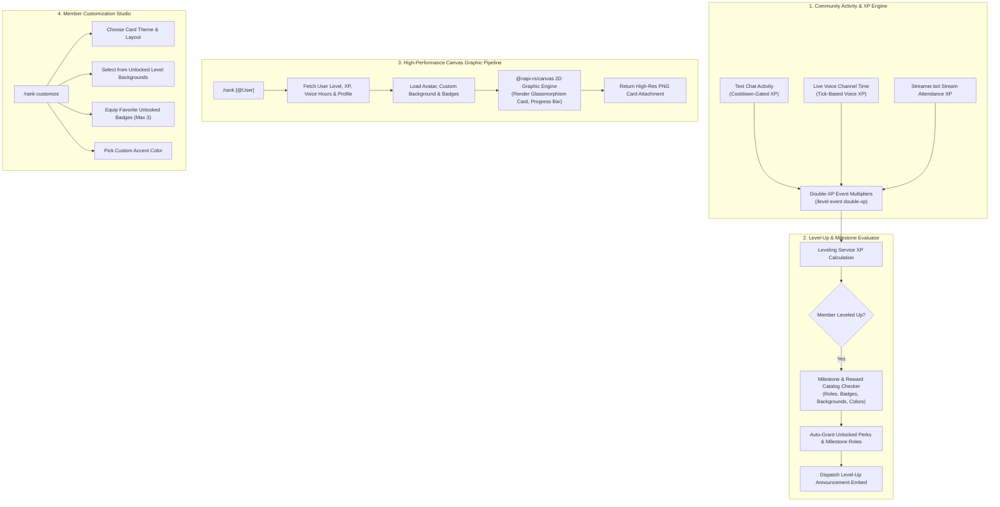
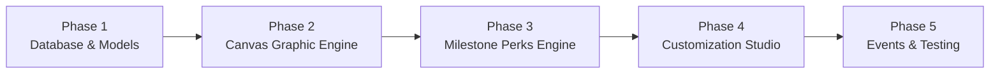

# 🎨 Canvas Rank Cards, Leveling 2.0 & Milestone Perks Module Plan

## Executive Summary & Vision

The **Canvas Rank Cards & Leveling 2.0 Module (`LEVELING_PRO`)** transforms SlickBot's community leveling system into a visually stunning, highly rewarding progression engine.

By replacing basic text-based rank embeds with high-resolution, graphic-rendered **Canvas Rank Cards** (`@napi-rs/canvas`), members can showcase their server status, voice hours, message counts, and collectible badges with pride. 

Furthermore, to provide deep progression without the clutter of a separate economy or virtual currency, Leveling 2.0 introduces the **Level Milestone & Unlockable Perks Engine**. As members level up through chat and voice activity, they automatically unlock custom vanity roles, collectible badges, custom rank card background banners, custom nickname color access, and temporary booster perks.

---

## 🏗️ System Architecture & Workflow



---

## 🌟 Core Feature Capabilities

### 1. High-Resolution Canvas Graphic Rank Cards
* **Ultra-Fast Rendering Engine:**
  - Built with `@napi-rs/canvas` (Rust-backed zero-dependency Canvas engine) rendering high-resolution 1000x300 PNG cards in milliseconds.
* **Rich Visual Elements:**
  - High-res user avatar clipped in circular or rounded-hex frames with live Discord presence indicator (Online, Idle, DND).
  - Modern glassmorphism progress bar with gradient fill and exact percentage indicator.
  - Server rank `#`, current level, total XP, next level target, total voice hours, and total messages.
  - Showcase rack displaying up to 3 equipped collectible badges.
  - Configurable server watermark or server booster icon.

```text
+---------------------------------------------------------------------------------------------------+
| [AVATAR]  SlickPickleNick #0001                                          RANK #1  |  LEVEL 42     |
| [######]  Role: Senior Moderator | 🎙️ Voice Master | 💬 Chat Virtuoso     XP: 14,250 / 15,000      |
|           Voice: 48.5 hrs | Messages: 3,420 | Server Booster                                      |
|           =====================================================[==========] 95.0%                 |
+---------------------------------------------------------------------------------------------------+
```

---

### 2. Level Milestone & Unlockable Perks Engine (Economy Replacement)
Instead of a separate virtual currency, all community rewards and cosmetics are directly tied to server leveling milestones:

* **1. Milestone Role Unlocks:**
  - Server admins configure tiered milestone roles awarded automatically upon reaching specific levels (e.g. Level 5: *Novice*, Level 20: *Veteran*, Level 50: *Server Legend*).
* **2. Collectible Milestone Badges:**
  - Unlock special visual badges displayed on rank cards and profile embeds for achieving specific milestones:
    - 🎙️ *Voice Master* (Unlocked at 50 voice hours)
    - 💬 *Chat Virtuoso* (Unlocked at 1,000 messages)
    - 🌟 *Night Owl* (Active during late-night hours)
    - 🚀 *Early Adopter* (Joined within the first 100 members)
* **3. Custom Rank Card Background Showcase:**
  - Server admins configure a catalog of custom image backgrounds that unlock at specific level thresholds (e.g. Level 10 unlock, Level 25 unlock, Level 50 prestige unlock) or via Server Booster perks.
* **4. Custom Nickname Color Access (`/rank color`):**
  - Members reaching Level 15+ unlock the ability to choose their personal role color from a curated palette.
* **5. Temporary Booster Tokens & Perks:**
  - Reaching major level milestones awards consumable double-XP personal booster passes or temporary VIP perks.

---

### 3. Member Customization Studio (`/rank customize`)
* **Interactive UI Designer:**
  - Opens a visual configuration panel allowing members to customize their rank card:
    - **Layout Style:** *Glassmorphism, Minimalist, Cyberpunk Neon, Sleek Dark, Retro Synthwave*.
    - **Accent Color:** Hex code or color picker.
    - **Background Banner:** Choose from default themes or unlocked level rewards.
    - **Equipped Badges:** Select up to 3 unlocked badges to showcase.
* **Live Instant Preview:**
  - Generates an immediate ephemeral preview of the customized card before saving.

---

### 4. Double XP Multipliers & Community Events
* **Server-Wide Event Multipliers:**
  - Admins can launch scheduled double or triple XP events with custom durations (e.g. `/level event start multiplier:2.0 duration:48h reason:"Weekend Hype Event"`).
* **Role & Channel Multipliers:**
  - Grant permanent XP multipliers to Server Boosters (e.g. 1.25x) or designate specific channels as double-XP zones.

---

### 5. Visual Graphic Leaderboards
* **Top 10 Canvas Banner:**
  - `/level leaderboard format:image` renders a visual Top 10 podium banner featuring top member avatars and levels.
* **Interactive Paginated Embed:**
  - Interactive Discord buttons to browse ranks 1 through 100 with voice hours and message counts.

---

## 🗄️ Database Schema Design

```sql
-- Extended leveling configuration per guild
ALTER TABLE leveling_configs ADD COLUMN IF NOT EXISTS card_default_theme TEXT NOT NULL DEFAULT 'DARK';
ALTER TABLE leveling_configs ADD COLUMN IF NOT EXISTS card_default_background_url TEXT;
ALTER TABLE leveling_configs ADD COLUMN IF NOT EXISTS card_accent_color TEXT NOT NULL DEFAULT '#7869ff';
ALTER TABLE leveling_configs ADD COLUMN IF NOT EXISTS card_branding_text TEXT;
ALTER TABLE leveling_configs ADD COLUMN IF NOT EXISTS event_multiplier NUMERIC(3, 2) NOT NULL DEFAULT 1.0;
ALTER TABLE leveling_configs ADD COLUMN IF NOT EXISTS event_multiplier_expires_at TIMESTAMPTZ;
ALTER TABLE leveling_configs ADD COLUMN IF NOT EXISTS voice_xp_per_minute INTEGER NOT NULL DEFAULT 5;

-- Extended member leveling profiles with personalization fields
ALTER TABLE leveling_profiles ADD COLUMN IF NOT EXISTS card_theme TEXT NOT NULL DEFAULT 'DARK';
ALTER TABLE leveling_profiles ADD COLUMN IF NOT EXISTS card_background_url TEXT;
ALTER TABLE leveling_profiles ADD COLUMN IF NOT EXISTS card_accent_color TEXT NOT NULL DEFAULT '#7869ff';
ALTER TABLE leveling_profiles ADD COLUMN IF NOT EXISTS card_layout TEXT NOT NULL DEFAULT 'GLASS';
ALTER TABLE leveling_profiles ADD COLUMN IF NOT EXISTS equipped_badge_ids JSONB DEFAULT '[]'::jsonb;
ALTER TABLE leveling_profiles ADD COLUMN IF NOT EXISTS custom_color_role_id TEXT;

-- Consolidated level rewards and milestone perk catalog
CREATE TABLE IF NOT EXISTS leveling_rewards (
  id TEXT PRIMARY KEY DEFAULT gen_random_uuid()::text,
  guild_id TEXT NOT NULL REFERENCES guild_configs(guild_id) ON DELETE CASCADE,
  level_requirement INTEGER NOT NULL,
  reward_type TEXT NOT NULL, -- 'ROLE', 'BADGE', 'BACKGROUND', 'COLOR_ACCESS', 'BOOSTER_TOKEN'
  role_id TEXT,
  badge_name TEXT,
  badge_icon TEXT,
  badge_description TEXT,
  background_name TEXT,
  background_url TEXT,
  created_at TIMESTAMPTZ NOT NULL DEFAULT NOW(),
  updated_at TIMESTAMPTZ NOT NULL DEFAULT NOW()
);

-- Member unlocked rewards and inventory
CREATE TABLE IF NOT EXISTS leveling_unlocked_perks (
  id TEXT PRIMARY KEY DEFAULT gen_random_uuid()::text,
  guild_id TEXT NOT NULL REFERENCES guild_configs(guild_id) ON DELETE CASCADE,
  user_id TEXT NOT NULL,
  reward_id TEXT NOT NULL REFERENCES leveling_rewards(id) ON DELETE CASCADE,
  unlocked_at TIMESTAMPTZ NOT NULL DEFAULT NOW(),
  UNIQUE(guild_id, user_id, reward_id)
);

-- Server badge catalog definitions
CREATE TABLE IF NOT EXISTS leveling_badges (
  id TEXT PRIMARY KEY DEFAULT gen_random_uuid()::text,
  guild_id TEXT NOT NULL REFERENCES guild_configs(guild_id) ON DELETE CASCADE,
  badge_key TEXT NOT NULL,
  name TEXT NOT NULL,
  icon TEXT NOT NULL,
  description TEXT,
  unlock_type TEXT NOT NULL, -- 'LEVEL', 'VOICE_HOURS', 'MESSAGES', 'MANUAL'
  unlock_threshold INTEGER NOT NULL DEFAULT 0,
  created_at TIMESTAMPTZ NOT NULL DEFAULT NOW(),
  UNIQUE(guild_id, badge_key)
);

CREATE INDEX IF NOT EXISTS idx_leveling_rewards_level ON leveling_rewards(guild_id, level_requirement);
CREATE INDEX IF NOT EXISTS idx_leveling_unlocked_lookup ON leveling_unlocked_perks(guild_id, user_id);
```

---

## 💻 Slash Command Suite (`/rank`, `/level`)

### Member Commands:
* `/rank [user: @member]`:
  - Renders and uploads the high-resolution Canvas graphic rank card.
* `/rank customize`:
  - Opens the interactive visual studio to configure card layout, theme, accent color, background banner, and equipped badges.
* `/rank perks [user: @member]`:
  - View all unlocked level milestone perks and preview upcoming rewards.
* `/rank color [hex_code: #HEX]`:
  - Select personal custom nickname color (if unlocked at required level).

### Staff & Administration Commands:
* `/level rewards add level:<lvl> type:<role|badge|background|color_access> [options]`:
  - Add a new milestone reward or cosmetic unlock to the server progression track.
* `/level rewards list`:
  - Browse and manage all configured milestone rewards.
* `/level rewards remove id:<reward_id>`:
  - Remove a configured milestone reward.
* `/level event start multiplier:<1.5|2.0|3.0> duration:<hours> [reason]`:
  - Launch a server-wide double XP event.
* `/level event stop`:
  - Manually end an active XP multiplier event.
* `/level leaderboard [page] [format: image/embed]`:
  - View the server leaderboard with visual podium banner or paginated embed.

---

## 🛠️ Step-by-Step Implementation Roadmap



### Phase 1: Database Foundation & Schema Updates
1. **Database Schema (`src/services/initDatabase.js`):**
   - Add columns to `leveling_configs` and `leveling_profiles`.
   - Create `leveling_rewards`, `leveling_unlocked_perks`, and `leveling_badges` tables.
2. **ActionKeys & Permissions:**
   - Register `LevelingRewardsManage`, `LevelingEventManage`, `LevelingRankCustomize`.

### Phase 2: Canvas Graphic Rendering Engine (`src/utils/canvasRankCard.js`)
1. **NAPI-RS Canvas Setup:**
   - Install and configure `@napi-rs/canvas` for ultra-fast multi-threaded image generation.
2. **Template Renderers:**
   - Build responsive layout templates (Glassmorphism, Minimalist, Cyberpunk, Retro).
   - Implement avatar circular clipping, rounded badge pills, and smooth gradient progress bars.

### Phase 3: Milestone Perks & Auto-Unlock Engine
1. **Level-Up Interceptor (`src/modules/leveling/levelingService.js`):**
   - On level up, query `leveling_rewards` for newly achieved thresholds.
   - Automatically assign unlocked roles, grant badge unlocks, and notify the member.

### Phase 4: Member Customization Studio (`src/modules/leveling/levelingUi.js`)
1. **Interactive Panel:**
   - Implement `/rank customize` modal and select menu handlers.
   - Allow members to equip only unlocked backgrounds and badges.
2. **Live Preview:**
   - Generate ephemeral preview card before committing profile changes.

### Phase 5: Event Multipliers & Automated Tests
1. **XP Multiplier Engine:**
   - Implement active event check during chat and voice XP calculation.
2. **Automated Unit Testing (`test/unit/levelingPro.test.js`):**
   - Test Canvas rendering buffer outputs, milestone reward triggers, badge unlocking, and XP multiplier calculations.

---

## 🔒 Performance, Caching & Resource Optimization

1. **Asset Caching:**
   - Default background banners and badge SVG assets are loaded into memory on bot startup to minimize disk I/O.
2. **Avatar Pre-Fetching:**
   - User avatars are fetched with HTTP timeouts and fallback to default Discord avatars if CDN latency occurs.
3. **Non-Blocking Canvas Execution:**
   - Card rendering runs asynchronously via `@napi-rs/canvas` native worker threads, preventing event loop blocking during peak chat hours.
