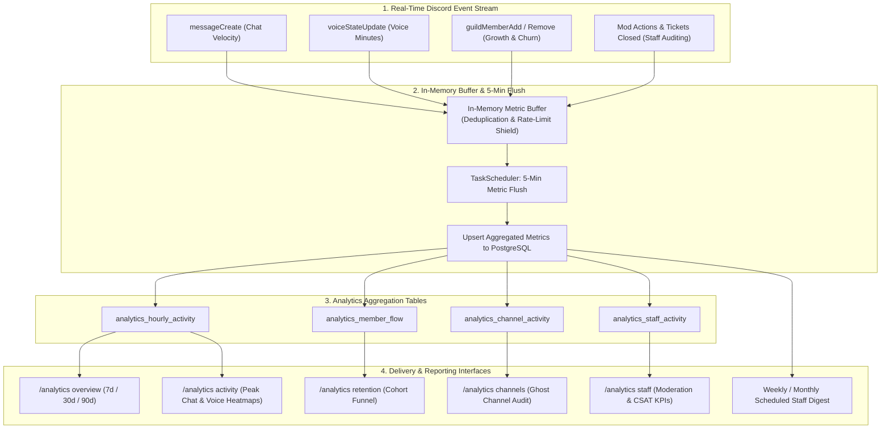
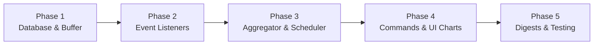

# 📊 Server Analytics & Engagement Pulse Module Plan

## Executive Summary & Vision

The **Server Analytics & Engagement Pulse Module (`ANALYTICS`)** provides server administrators and community managers with real-time, actionable insights into community health, chat velocity, voice participation, member retention, and staff moderation performance directly inside Discord.

Instead of forcing server owners to use third-party analytics platforms with complex external logins, SlickBot tracks server activity in lightweight time-bucketed aggregations and presents high-fidelity interactive reports, activity heatmaps, retention funnels, and scheduled executive summaries.

---

## 🏗️ System Architecture & Workflow



---

## 🌟 Core Feature Capabilities

### 1. Hourly Message & Voice Velocity (Activity Heatmaps)
* **Chat & Voice Velocity Tracking:**
  - Tracks total message count, unique chatters, total voice minutes spent, and concurrent voice participant peaks.
* **Peak Hours Heatmap Visualization:**
  - Identifies the highest engagement hours of the day (00:00 to 23:00 UTC / Server Local Time) and peak days of the week (Monday through Sunday).
  - Recommends optimal windows for announcements, live streams, and community events.
* **Discord-Native Visual Charts:**
  - Visualized using modern ASCII sparklines, Unicode bar charts (`█▓▒░`), and dynamic embed graphs.

```text
+------------------------------------------------------------------------+
| 📊 SERVER ACTIVITY HEATMAP (Last 30 Days)                              |
| Peak Activity Window: Friday & Saturday | 8:00 PM – 11:00 PM EDT       |
|                                                                        |
| 💬 Hourly Message Volume:                                              |
| 12 AM - 04 AM: █▒░░░░░░░░  (1,240 msgs)                                |
| 04 AM - 08 AM: ░░░░░░░░░░  (310 msgs)                                  |
| 08 AM - 12 PM: ████▒░░░░░  (4,820 msgs)                                |
| 12 PM - 04 PM: ████████▒░  (9,450 msgs)                                |
| 04 PM - 08 PM: ██████████  (14,200 msgs)  🔥 PEAK                      |
| 08 PM - 12 AM: █████████▒  (12,100 msgs)                               |
|                                                                        |
| 🔊 Total Voice Time: 1,482 Hours | Top Voice Day: Saturday             |
+------------------------------------------------------------------------+
```

---

### 2. Member Retention & Conversion Funnel
* **Joins vs Leaves Dynamics:**
  - Net member growth rate over 7, 30, and 90-day intervals.
* **New Member Retention Cohorts:**
  - Tracks what percentage of new joins remain in the server after **Day 1**, **Day 7**, and **Day 30**.
* **Onboarding & Verification Conversion:**
  - Measures percentage of joins who successfully pass verification (`/verify`) and claim their first reaction roles.
* **Referral Source Breakdown:**
  - Links retention metrics back to referral codes (`/referral`) to determine which invite sources bring the most active members.

---

### 3. Channel Engagement & Ghost Channel Audit
* **High-Traffic Hubs vs Dormant Channels:**
  - Ranks text channels by total messages and unique participant ratios.
* **Ghost Channel Detection:**
  - Highlights channels with fewer than 5 messages in 30 days to help server admins consolidate categories and reduce channel clutter.
* **Voice Channel Utilization:**
  - Tracks average occupancy and session durations per voice channel.

---

### 4. Staff Moderation & Support Audit
* **Staff Action Metrics:**
  - Total warnings issued, timeouts applied, kicks, bans, and auto-mod filters triggered.
  - Distribution of actions by individual staff member or permission team.
* **Support System KPIs:**
  - Total tickets opened, average First Response Time (FRT), Average Resolution Time (ART), and average CSAT satisfaction rating.

---

### 5. Automated Weekly / Monthly Server Digest
* **Scheduled Executive Reports:**
  - Dispatches an automated executive summary embed every Monday (or 1st of the month) to designated staff channels.
  - Highlights weekly top chatters, top voice members, net member growth, most active channels, and support response times.

---

## 🗄️ Database Schema Design

```sql
-- Global analytics configuration per guild
CREATE TABLE IF NOT EXISTS analytics_configs (
  guild_id TEXT PRIMARY KEY REFERENCES guild_configs(guild_id) ON DELETE CASCADE,
  enabled BOOLEAN NOT NULL DEFAULT true,
  digest_channel_id TEXT,
  digest_frequency TEXT NOT NULL DEFAULT 'WEEKLY', -- 'WEEKLY', 'MONTHLY', 'OFF'
  digest_day_of_week INTEGER NOT NULL DEFAULT 1, -- 1 = Monday, 7 = Sunday
  digest_hour_utc INTEGER NOT NULL DEFAULT 14, -- 14:00 UTC
  retention_days INTEGER NOT NULL DEFAULT 90,
  created_at TIMESTAMPTZ NOT NULL DEFAULT NOW(),
  updated_at TIMESTAMPTZ NOT NULL DEFAULT NOW()
);

-- Hourly message and voice velocity aggregations
CREATE TABLE IF NOT EXISTS analytics_hourly_activity (
  id TEXT PRIMARY KEY DEFAULT gen_random_uuid()::text,
  guild_id TEXT NOT NULL REFERENCES guild_configs(guild_id) ON DELETE CASCADE,
  bucket_hour TIMESTAMPTZ NOT NULL, -- Truncated to hour (YYYY-MM-DD HH:00:00)
  message_count INTEGER NOT NULL DEFAULT 0,
  unique_chatters_count INTEGER NOT NULL DEFAULT 0,
  voice_minutes INTEGER NOT NULL DEFAULT 0,
  active_voice_count INTEGER NOT NULL DEFAULT 0,
  created_at TIMESTAMPTZ NOT NULL DEFAULT NOW(),
  UNIQUE(guild_id, bucket_hour)
);

-- Daily channel activity tracking for ghost channel auditing
CREATE TABLE IF NOT EXISTS analytics_channel_activity (
  id TEXT PRIMARY KEY DEFAULT gen_random_uuid()::text,
  guild_id TEXT NOT NULL REFERENCES guild_configs(guild_id) ON DELETE CASCADE,
  channel_id TEXT NOT NULL,
  bucket_date DATE NOT NULL,
  message_count INTEGER NOT NULL DEFAULT 0,
  unique_authors_count INTEGER NOT NULL DEFAULT 0,
  created_at TIMESTAMPTZ NOT NULL DEFAULT NOW(),
  UNIQUE(guild_id, channel_id, bucket_date)
);

-- Daily member join/leave and retention flow
CREATE TABLE IF NOT EXISTS analytics_member_flow (
  id TEXT PRIMARY KEY DEFAULT gen_random_uuid()::text,
  guild_id TEXT NOT NULL REFERENCES guild_configs(guild_id) ON DELETE CASCADE,
  bucket_date DATE NOT NULL,
  joins_count INTEGER NOT NULL DEFAULT 0,
  leaves_count INTEGER NOT NULL DEFAULT 0,
  verified_count INTEGER NOT NULL DEFAULT 0,
  retained_day_1 INTEGER NOT NULL DEFAULT 0,
  retained_day_7 INTEGER NOT NULL DEFAULT 0,
  retained_day_30 INTEGER NOT NULL DEFAULT 0,
  created_at TIMESTAMPTZ NOT NULL DEFAULT NOW(),
  UNIQUE(guild_id, bucket_date)
);

-- Daily staff moderation and support performance metrics
CREATE TABLE IF NOT EXISTS analytics_staff_activity (
  id TEXT PRIMARY KEY DEFAULT gen_random_uuid()::text,
  guild_id TEXT NOT NULL REFERENCES guild_configs(guild_id) ON DELETE CASCADE,
  staff_user_id TEXT NOT NULL,
  bucket_date DATE NOT NULL,
  warns_count INTEGER NOT NULL DEFAULT 0,
  timeouts_count INTEGER NOT NULL DEFAULT 0,
  kicks_count INTEGER NOT NULL DEFAULT 0,
  bans_count INTEGER NOT NULL DEFAULT 0,
  tickets_claimed_count INTEGER NOT NULL DEFAULT 0,
  tickets_closed_count INTEGER NOT NULL DEFAULT 0,
  created_at TIMESTAMPTZ NOT NULL DEFAULT NOW(),
  UNIQUE(guild_id, staff_user_id, bucket_date)
);

CREATE INDEX IF NOT EXISTS idx_analytics_hourly_lookup ON analytics_hourly_activity(guild_id, bucket_hour DESC);
CREATE INDEX IF NOT EXISTS idx_analytics_channel_lookup ON analytics_channel_activity(guild_id, bucket_date DESC, message_count DESC);
CREATE INDEX IF NOT EXISTS idx_analytics_member_flow_lookup ON analytics_member_flow(guild_id, bucket_date DESC);
CREATE INDEX IF NOT EXISTS idx_analytics_staff_lookup ON analytics_staff_activity(guild_id, bucket_date DESC);
```

---

## 💻 Slash Command Suite (`/analytics`)

### Overview & Activity:
* `/analytics overview [timeframe: 7d/30d/90d]`:
  - Visual dashboard showing net member growth, message volume, voice hours, active chatters, and retention rate.
* `/analytics activity [metric: messages/voice] [timeframe: 7d/30d]`:
  - Renders hourly and day-of-week heatmaps pinpointing prime community engagement hours.
* `/analytics retention [timeframe: 30d/90d]`:
  - Displays new join conversion, day-1/7/30 retention percentages, and top referral invite sources.

### Channel & Staff Auditing:
* `/analytics channels [sort: most_active/least_active/ghost]`:
  - Ranks text channels by activity. Identifies ghost channels dormant for 30+ days.
* `/analytics staff [staff_member: @user] [timeframe: 7d/30d]`:
  - Breaks down moderation cases, ticket response times, and average CSAT satisfaction scores.

### Administration & Scheduled Digests:
* `/analytics setup [digest_channel] [frequency: weekly/monthly] [day] [hour_utc]`:
  - Configure scheduled executive summary digests.
* `/analytics export timeframe:<7d|30d|90d> format:<csv|json>`:
  - Generate a downloadable CSV data export file.

---

## 🛠️ Step-by-Step Implementation Roadmap



### Phase 1: Database Foundation & In-Memory Metric Buffer
1. **Database Schema (`src/services/initDatabase.js`):**
   - Add schema definitions for `analytics_configs`, `analytics_hourly_activity`, `analytics_channel_activity`, `analytics_member_flow`, and `analytics_staff_activity`.
2. **In-Memory Buffer Layer (`src/modules/analytics/analyticsBuffer.js`):**
   - Implement an in-memory queue collecting raw event counters to avoid direct database writes on every message.
3. **Module & Permissions Registration:**
   - Register `ModuleKeys.ANALYTICS` in `src/modules/moduleRegistry.js`.
   - Register ActionKeys (`AnalyticsView`, `AnalyticsManage`, `AnalyticsExport`).

### Phase 2: Event Stream Interceptors
1. **Message & Voice Hooks (`src/index.js`):**
   - Increment hourly message counts, track unique user IDs in sets, and track voice session start/end intervals.
2. **Member Flow Hooks (`src/index.js`):**
   - Record `guildMemberAdd` and `guildMemberRemove` flow counts.
3. **Moderation & Support Hooks:**
   - Hook into `caseService.js`, `automodService.js`, and `supportService.js` to log staff activity.

### Phase 3: Background Flusher & Aggregation Engine
1. **TaskScheduler Registration (`src/services/taskScheduler.js`):**
   - Register `analytics-flush` task running every 5 minutes to flush in-memory counters into PostgreSQL.
   - Register `analytics-cleanup` task running daily to prune records older than configured retention limits (e.g. 90 days).

### Phase 4: Slash Command Suite & Visual Embed Charts
1. **Visual Chart Helpers (`src/modules/analytics/analyticsUi.js`):**
   - Develop Unicode bar chart and sparkline generators for embed descriptions.
2. **Slash Command Implementation (`src/commands/analytics.js`):**
   - Implement `/analytics overview`, `/analytics activity`, `/analytics retention`, `/analytics channels`, `/analytics staff`, and `/analytics export`.

### Phase 5: Scheduled Executive Digests & Automated Tests
1. **Digest Runner:**
   - Implement weekly/monthly digest builder posting executive summaries to staff channels.
2. **Automated Unit Testing (`test/unit/analytics.test.js`):**
   - Test in-memory buffer flushing, deduplication, time-bucket aggregation, and CSV export formatting.

---

## 🔒 Privacy, Performance & Data Retention

1. **Privacy & Anonymization:**
   - All message content is strictly discarded; only numeric volume counts, channel IDs, and unique author hashes are retained.
2. **Database Performance & Indexing:**
   - High-write throughput is mitigated by the 5-minute in-memory aggregation buffer, converting thousands of raw events into single batch upserts.
3. **Automated Pruning:**
   - Raw hourly records older than 90 days are automatically rolled up into monthly summaries or pruned to prevent database bloat.
