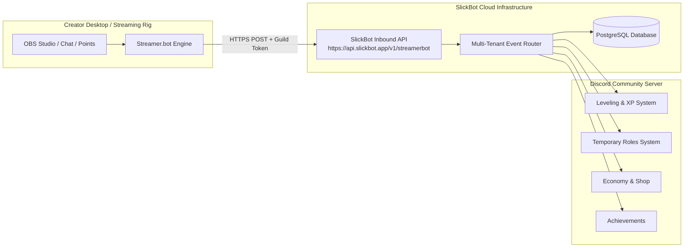

# 🎮 SlickBot & Streamer.bot Integration Architecture

## Overview & Vision

**Streamer.bot** is the premier local automation tool for livestreamers on Twitch, YouTube, and Trovo. It allows creators to trigger complex OBS scenes, lighting, audio alerts, and community rewards directly from chat events, channel points, subs, and raids.

By integrating **SlickBot with Streamer.bot on a per-server basis**, communities can bridge live streaming engagement with persistent Discord progression:
* **Stream Attendance XP & Progression:** Award Discord leveling XP and community achievements for actively watching livestreams.
* **Stream Drop & Code Redemptions (`/redeem`):** Streamers generate one-time or quantity-limited codes on stream that viewers redeem in Discord for XP, server coins, or custom roles.
* **Twitch Channel Points to Discord Perks:** Automatically grant temporary Discord VIP roles, custom color roles, or channel access when viewers redeem Channel Points on Twitch.
* **Live Event Milestone Hype:** Instant Discord announcement triggers on raids, hype trains, sub bombs, or donations.

---

## 🏗️ Multi-Tenant Architecture & Connection Model

Because Streamer.bot runs locally on each creator's PC behind residential NATs/firewalls, having a cloud Discord bot initiate outbound connections to thousands of individual IP addresses creates connection hurdles (port forwarding, dynamic IPs, firewall rules).

To solve this cleanly, SlickBot uses an **Inbound Authenticated Webhook & REST Gateway Architecture**:



### How Per-Server Multi-Tenancy Works
1. **Per-Guild API Tokens:** Each Discord server generates a unique, cryptographically signed API token (`sb_live_...`) via `/streamerbot key generate`.
2. **Deterministic Routing:** When Streamer.bot sends an HTTP payload to SlickBot, SlickBot validates the token header (`x-slickbot-token`), identifies the exact `guild_id`, and executes the action within that server's database partition.
3. **Dual Identity Pairing:** Viewers link their Twitch/YouTube account to their Discord account via `/streamerbot link` (or auto-matched via Discord's connected accounts metadata).

---

## 🔑 Security & Authentication

1. **Token Structure:** 
   - Format: `sb_live_<guild_id>_<32_byte_random_hex>`
   - Stored hashed (SHA-256) in `streamerbot_configs` table.
2. **Rate Limiting & Anti-Abuse:**
   - Maximum 120 requests per minute per server.
   - Duplicate event deduplication window (5 seconds) using unique `event_id` keys.
3. **Secret Rotation:**
   - Server admins can regenerate or revoke tokens instantly with `/streamerbot key rotate` or `/streamerbot key revoke`.

---

## 📡 Core API Webhook Endpoints

All requests are sent via `POST` to:
`https://api.slickbot.app/v1/streamerbot/events` (or your self-hosted Railway domain)

### Common Request Headers:
```http
POST /v1/streamerbot/events HTTP/1.1
Host: api.slickbot.app
Content-Type: application/json
x-slickbot-token: sb_live_123456789012345678_abcdef0123456789abcdef0123456789
```

---

### 1. Stream Watch Attendance Tick (`ATTENDANCE_TICK`)
Streamer.bot fires this event every 5–10 minutes with a list of active chatters/viewers.

#### Payload:
```json
{
  "event": "ATTENDANCE_TICK",
  "event_id": "tick_20260826_093000",
  "stream_platform": "TWITCH",
  "channel_name": "SlickPickleNick",
  "viewers": [
    { "platform_user_id": "123456", "platform_username": "slickfan99" },
    { "platform_user_id": "789012", "platform_username": "picklepro" }
  ],
  "reward_xp": 25,
  "reward_coins": 10
}
```

#### SlickBot Action:
* Matches platform users to Discord members.
* Increments user XP in `leveling_profiles` and coins in `economy_wallets`.
* Increments stream attendance minutes in `achievement_progress`.

---

### 2. Stream Drop Code Creation (`CODE_CREATE`)
Streamer.bot triggers a secret drop code during hype moments (e.g. after a big win or stream milestone).

#### Payload:
```json
{
  "event": "CODE_CREATE",
  "event_id": "drop_boss_kill_99",
  "code": "SLICKVICTORY",
  "max_uses": 50,
  "expires_in_minutes": 30,
  "reward_type": "XP_AND_COINS",
  "xp_amount": 250,
  "coins_amount": 100,
  "role_id": null
}
```

#### SlickBot Action:
* Stores active code in `streamerbot_redeem_codes`.
* Viewers in Discord run `/redeem code:SLICKVICTORY` to claim the rewards.

---

### 3. Channel Point Perk Grant (`CHANNEL_POINT_REWARD`)
Triggered when a viewer redeems a Channel Point reward on Twitch.

#### Payload:
```json
{
  "event": "CHANNEL_POINT_REWARD",
  "event_id": "cp_redemption_abc123",
  "platform_username": "slickfan99",
  "platform_user_id": "123456",
  "reward_title": "Discord 24h VIP Role",
  "action_type": "GRANT_TEMP_ROLE",
  "role_id": "987654321098765432",
  "duration_hours": 24
}
```

#### SlickBot Action:
* Automatically assigns the Discord role for 24 hours using the `TEMP_ROLES` module.
* Logs redemption in staff logging channel and sends confirmation DM to the member.

---

### 4. Milestone Hype Announcement (`MILESTONE_ALERT`)
Triggered on Raids, Sub Bombs, or Hype Train level-ups.

#### Payload:
```json
{
  "event": "MILESTONE_ALERT",
  "event_id": "raid_party_442",
  "milestone_type": "RAID",
  "initiator_name": "StreamerFriend",
  "viewer_count": 150,
  "channel_name": "SlickPickleNick",
  "custom_message": "StreamerFriend just raided with 150 viewers!"
}
```

#### SlickBot Action:
* Posts a styled announcement embed into the server's configured stream hype channel with celebration graphics.

---

## 🛠️ Step-by-Step Streamer.bot Setup Guide

### Step 1: Generate Server Credentials in Discord
1. Run `/streamerbot setup` in your Discord server.
2. Select your announcement channel and configure default attendance XP (e.g. 25 XP per 10 min).
3. Run `/streamerbot key generate` (ephemeral response).
4. Copy your **API Token** and **Endpoint URL**.

---

### Step 2: Configure Streamer.bot Actions

#### Method A: Using Streamer.bot "Fetch URL" Sub-Action (Zero Coding)
1. In Streamer.bot, go to **Actions** -> Right-Click -> **Add Action** (e.g. `Discord - Stream Code Drop`).
2. Add Sub-Action -> **Core** -> **Network** -> **Fetch URL**.
3. Fill in:
   - **URL:** `https://api.slickbot.app/v1/streamerbot/events`
   - **Method:** `POST`
   - **Headers:**
     ```text
     Content-Type: application/json
     x-slickbot-token: YOUR_COPIED_TOKEN_HERE
     ```
   - **Body:**
     ```json
     {
       "event": "CODE_CREATE",
       "event_id": "%timestamp%",
       "code": "%dropCode%",
       "max_uses": 30,
       "expires_in_minutes": 15,
       "xp_amount": 200
     }
     ```

---

#### Method B: Using Streamer.bot C# Custom Code (Advanced Attendance Sync)
For automatic active viewer sync, add an **Execute C# Code** sub-action:

```csharp
using System;
using System.Net.Http;
using System.Text;
using System.Threading.Tasks;

public class CPHInline
{
    private static readonly HttpClient client = new HttpClient();

    public bool Execute()
    {
        string botEndpoint = "https://api.slickbot.app/v1/streamerbot/events";
        string guildToken = "sb_live_YOUR_TOKEN_HERE";

        // Retrieve active chatters from Streamer.bot context
        var users = CPH.GetUsers();
        var viewerList = new StringBuilder("[");

        for (int i = 0; i < users.Count; i++)
        {
            viewerList.Append($"{{\"platform_user_id\":\"{users[i].Id}\",\"platform_username\":\"{users[i].Name}\"}}");
            if (i < users.Count - 1) viewerList.Append(",");
        }
        viewerList.Append("]");

        string jsonPayload = $"{{\"event\":\"ATTENDANCE_TICK\",\"event_id\":\"tick_{DateTimeOffset.UtcNow.ToUnixTimeSeconds()}\",\"stream_platform\":\"TWITCH\",\"channel_name\":\"SlickPickleNick\",\"viewers\":{viewerList.ToString()},\"reward_xp\":25}}";

        var request = new HttpRequestMessage(HttpMethod.Post, botEndpoint);
        request.Headers.Add("x-slickbot-token", guildToken);
        request.Content = new StringContent(jsonPayload, Encoding.UTF8, "application/json");

        try
        {
            var response = client.SendAsync(request).Result;
            CPH.LogInfo($"[SlickBot] Attendance sent. Status: {response.StatusCode}");
            return response.IsSuccessStatusCode;
        }
        catch (Exception ex)
        {
            CPH.LogError($"[SlickBot] Error sending attendance: {ex.Message}");
            return false;
        }
    }
}
```

---

## 💬 Member Linking & Discord Commands

### Member Commands
* `/streamerbot link platform:<twitch|youtube> username:<name>`: Pairs viewer stream account to their Discord user ID.
* `/streamerbot unlink`: Removes platform linkage.
* `/redeem code:<code>`: Redeems a stream drop code for XP, coins, or roles.
* `/streamerbot profile`: Displays viewer stream watch hours, linked platform usernames, and claimed rewards.

### Administrator Commands
* `/streamerbot setup`: Interactive wizard for default channels, attendance XP rates, and perk rules.
* `/streamerbot manager`: Interactive dashboard with connection status, recent event logs, and toggle controls.
* `/streamerbot key <generate|rotate|revoke>`: Manage server API tokens securely.
* `/streamerbot code create [code] [xp] [coins] [max_uses] [duration]`: Manually create a drop code from Discord.
* `/streamerbot code list`: View active, expired, and claimed drop codes.

---

## 🗄️ Database Schema Additions

```sql
-- Streamer.bot server configuration & credentials
CREATE TABLE IF NOT EXISTS streamerbot_configs (
  guild_id TEXT PRIMARY KEY REFERENCES guild_configs(guild_id) ON DELETE CASCADE,
  enabled BOOLEAN NOT NULL DEFAULT true,
  api_token_hash TEXT UNIQUE,
  token_created_at TIMESTAMPTZ,
  streamer_channel_name TEXT,
  attendance_xp_rate INTEGER NOT NULL DEFAULT 25,
  attendance_coins_rate INTEGER NOT NULL DEFAULT 10,
  attendance_interval_minutes INTEGER NOT NULL DEFAULT 10,
  announcement_channel_id TEXT,
  log_channel_id TEXT,
  created_at TIMESTAMPTZ NOT NULL DEFAULT NOW(),
  updated_at TIMESTAMPTZ NOT NULL DEFAULT NOW()
);

-- Member platform link pairings (Twitch/YouTube to Discord)
CREATE TABLE IF NOT EXISTS streamerbot_member_links (
  id TEXT PRIMARY KEY DEFAULT gen_random_uuid()::text,
  guild_id TEXT NOT NULL REFERENCES guild_configs(guild_id) ON DELETE CASCADE,
  user_id TEXT NOT NULL,
  platform TEXT NOT NULL, -- 'TWITCH', 'YOUTUBE'
  platform_user_id TEXT,
  platform_username TEXT NOT NULL,
  verified BOOLEAN NOT NULL DEFAULT true,
  created_at TIMESTAMPTZ NOT NULL DEFAULT NOW(),
  UNIQUE(guild_id, user_id, platform),
  UNIQUE(guild_id, platform, platform_username)
);

-- Stream drop & redemption codes
CREATE TABLE IF NOT EXISTS streamerbot_redeem_codes (
  id TEXT PRIMARY KEY DEFAULT gen_random_uuid()::text,
  guild_id TEXT NOT NULL REFERENCES guild_configs(guild_id) ON DELETE CASCADE,
  code TEXT NOT NULL,
  reward_type TEXT NOT NULL DEFAULT 'XP', -- 'XP', 'COINS', 'ROLE', 'BUNDLE'
  xp_amount INTEGER NOT NULL DEFAULT 0,
  coins_amount INTEGER NOT NULL DEFAULT 0,
  role_id TEXT,
  max_uses INTEGER NOT NULL DEFAULT 1,
  current_uses INTEGER NOT NULL DEFAULT 0,
  expires_at TIMESTAMPTZ,
  created_by_user_id TEXT,
  created_at TIMESTAMPTZ NOT NULL DEFAULT NOW(),
  UNIQUE(guild_id, code)
);

-- Code redemption tracking to enforce single redemption per user
CREATE TABLE IF NOT EXISTS streamerbot_code_claims (
  id TEXT PRIMARY KEY DEFAULT gen_random_uuid()::text,
  code_id TEXT NOT NULL REFERENCES streamerbot_redeem_codes(id) ON DELETE CASCADE,
  guild_id TEXT NOT NULL REFERENCES guild_configs(guild_id) ON DELETE CASCADE,
  user_id TEXT NOT NULL,
  claimed_at TIMESTAMPTZ NOT NULL DEFAULT NOW(),
  UNIQUE(code_id, user_id)
);

-- Inbound event log & deduplication table
CREATE TABLE IF NOT EXISTS streamerbot_events_log (
  id TEXT PRIMARY KEY DEFAULT gen_random_uuid()::text,
  guild_id TEXT NOT NULL REFERENCES guild_configs(guild_id) ON DELETE CASCADE,
  event_type TEXT NOT NULL,
  event_id TEXT NOT NULL,
  payload JSONB NOT NULL DEFAULT '{}'::jsonb,
  status TEXT NOT NULL DEFAULT 'PROCESSED',
  received_at TIMESTAMPTZ NOT NULL DEFAULT NOW(),
  UNIQUE(guild_id, event_id)
);

CREATE INDEX IF NOT EXISTS idx_streamerbot_links_lookup ON streamerbot_member_links(guild_id, platform, platform_username);
CREATE INDEX IF NOT EXISTS idx_streamerbot_codes_active ON streamerbot_redeem_codes(guild_id, code, expires_at);
```

---

## 🚀 Implementation Milestones

| Step | Milestone Deliverable | Key Tasks |
| :--- | :--- | :--- |
| **Phase 1** | **API Gateway & Token Auth** | Create Express route `/v1/streamerbot/events` in `src/services/healthServer.js`, token hashing & validation middleware, rate limiter. |
| **Phase 2** | **Redemption Codes & Linking** | Build `/streamerbot link`, `/redeem`, database schema migration, and claim enforcement. |
| **Phase 3** | **Attendance XP & Leveling Link** | Process `ATTENDANCE_TICK` batches, link with `leveling_profiles` and `achievement_progress`. |
| **Phase 4** | **Channel Point Temp Roles** | Connect `CHANNEL_POINT_REWARD` events to `TEMP_ROLES` module for automatic timed role assignments. |
| **Phase 5** | **Discord Manager Panel & Wizards** | Build `/streamerbot setup`, `/streamerbot manager`, `/streamerbot key` interactive UI panels. |

---

*For the complete product roadmap and upcoming module schedule, refer to the [SlickBot Development Roadmap](./DEVELOPMENT_ROADMAP.md).*
