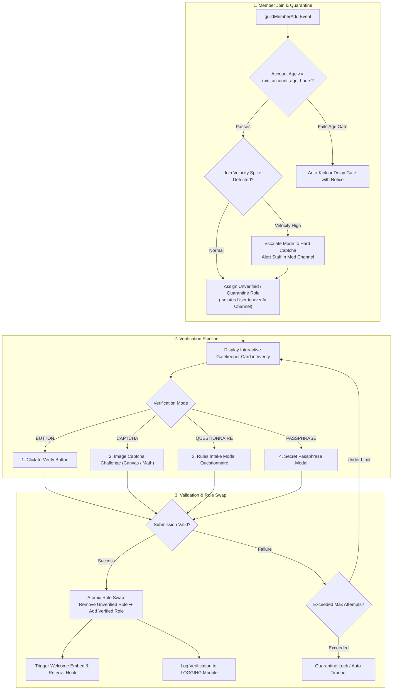
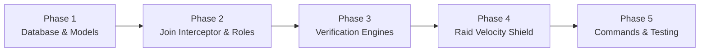

# 🛡️ Verification & Gatekeeper Shield Module Plan

## Executive Summary & Vision

The **Verification & Gatekeeper Shield Module (`VERIFICATION`)** provides an enterprise-grade onboarding gatekeeper designed to protect Discord communities from malicious raid bots, spam accounts, automated self-bots, and ban-evaders.

By isolating unverified members into a quarantined onboarding state and offering multiple verification mechanisms (One-Click Button, Alphanumeric/Math Image Captcha, Rules Questionnaire, or Secret Passphrase), SlickBot guarantees that only genuine human members gain access to the server. Furthermore, the **Dynamic Raid Shield Velocity Lock** monitors real-time join spikes and automatically escalates verification security during mass-join raids.

---

## 🏗️ System Architecture & Workflow



---

## 🌟 Core Feature Capabilities

### 1. Quarantine Role Isolation & Zero-Leakage Architecture
* **Strict Permission Isolation:**
  - Upon joining, new members receive an `unverified_role` with channel permissions restricted exclusively to the `#verify` channel.
  - Channels across the server deny `ViewChannel` or `SendMessages` to the unverified role, preventing any spam leaks before verification.
* **Atomic Role Swap:**
  - When verified, SlickBot executes an atomic transaction removing the unverified role and granting the official `verified_role` (and optional onboarding starter roles).

---

### 2. Multi-Tiered Verification Modes

```text
+------------------------------------------------------------------------+
| 🛡️ SERVER VERIFICATION & GATEWAY                                       |
| Welcome to the server! To prevent spam bots and access the channels,   |
| please complete the verification challenge below.                      |
|                                                                        |
| 📜 Rule Reminder: Respect all members and follow Discord ToS.          |
|                                                                        |
| [ 🔒 Verify Access ]   [ ❓ Help / Support Ticket ]                     |
+------------------------------------------------------------------------+
```

1. **One-Click Button Mode (`BUTTON`):**
   - Ideal for casual communities. Members click `[ 🔒 Verify Access ]` to agree to rules and gain access immediately.
2. **Image Captcha Challenge (`CAPTCHA`):**
   - Generates a distorted 6-character alphanumeric image or simple math challenge rendered dynamically.
   - User inputs the solution via an interactive modal.
   - Prevents automated user-bots from executing mass-joins.
3. **Rules Questionnaire Modal (`QUESTIONNAIRE`):**
   - Prompts the user with customizable intake questions (e.g. *“What is Rule #3?”*, *“How did you find this server?”*).
   - Responses are evaluated against configured answer keys or routed to staff review.
4. **Secret Passphrase Mode (`PASSPHRASE`):**
   - Admins hide a secret codeword inside the server's `#rules` channel.
   - Members input the secret word in the verification modal to confirm they read the rules.

---

### 3. Dynamic Raid Shield Velocity Lock
* **Automated Spike Detection:**
  - Monitors join frequency (e.g. if >10 joins occur within 30 seconds).
* **Automatic Security Escalation:**
  - If a velocity spike is detected, SlickBot automatically escalates verification security (e.g. upgrades from `BUTTON` to `CAPTCHA` mode or temporary lockdown) and alerts moderators in the logging channel.
* **Auto-Cooldown Recovery:**
  - After join velocity stabilizes for 10 minutes, verification automatically returns to normal mode.

---

### 4. Minimum Account Age & Security Filters
* **Account Age Gate:**
  - Configurable minimum account age (e.g. minimum 24 hours, 3 days, or 7 days old).
  - Brand-new accounts younger than the threshold can be auto-kicked, quarantined with an explanation notice, or required to solve a harder captcha.
* **Avatar & Default Account Checks:**
  - Option to require an avatar before permitting verification.

---

### 5. Staff Management, Overrides & Pruning
* **Staff Bypass:**
  - Staff can bypass verification for verified friends or trusted creators using `/verify bypass @User`.
* **Unverified Pruning:**
  - Automatically or manually prune members who have remained in the unverified quarantine role for longer than a specified duration (e.g. older than 48 hours) using `/verify prune-unverified`.

---

## 🗄️ Database Schema Design

```sql
-- Verification configuration per guild
CREATE TABLE IF NOT EXISTS verification_configs (
  guild_id TEXT PRIMARY KEY REFERENCES guild_configs(guild_id) ON DELETE CASCADE,
  enabled BOOLEAN NOT NULL DEFAULT false,
  mode TEXT NOT NULL DEFAULT 'BUTTON', -- 'BUTTON', 'CAPTCHA', 'QUESTIONNAIRE', 'PASSPHRASE'
  channel_id TEXT,
  verified_role_id TEXT,
  unverified_role_id TEXT,
  min_account_age_hours INTEGER NOT NULL DEFAULT 0, -- 0 = disabled
  require_avatar BOOLEAN NOT NULL DEFAULT false,
  captcha_type TEXT NOT NULL DEFAULT 'ALPHANUMERIC', -- 'ALPHANUMERIC', 'MATH'
  captcha_max_attempts INTEGER NOT NULL DEFAULT 3,
  passphrase TEXT,
  questions JSONB, -- Array of { question: string, required: boolean, expected_answer?: string }
  raid_velocity_threshold INTEGER NOT NULL DEFAULT 10, -- Joins within window
  raid_velocity_window_seconds INTEGER NOT NULL DEFAULT 30,
  raid_auto_escalate_mode TEXT NOT NULL DEFAULT 'CAPTCHA', -- 'CAPTCHA', 'LOCKDOWN'
  quarantine_timeout_hours INTEGER NOT NULL DEFAULT 48, -- Auto-kick after X hours if unverified
  log_channel_id TEXT,
  panel_title TEXT,
  panel_description TEXT,
  panel_image_url TEXT,
  created_at TIMESTAMPTZ NOT NULL DEFAULT NOW(),
  updated_at TIMESTAMPTZ NOT NULL DEFAULT NOW()
);

-- Active verification attempts and captcha session states
CREATE TABLE IF NOT EXISTS verification_attempts (
  id TEXT PRIMARY KEY DEFAULT gen_random_uuid()::text,
  guild_id TEXT NOT NULL REFERENCES guild_configs(guild_id) ON DELETE CASCADE,
  user_id TEXT NOT NULL,
  mode TEXT NOT NULL,
  captcha_solution TEXT,
  attempts_count INTEGER NOT NULL DEFAULT 0,
  status TEXT NOT NULL DEFAULT 'PENDING', -- 'PENDING', 'VERIFIED', 'FAILED', 'EXPIRED'
  expires_at TIMESTAMPTZ NOT NULL,
  created_at TIMESTAMPTZ NOT NULL DEFAULT NOW(),
  updated_at TIMESTAMPTZ NOT NULL DEFAULT NOW(),
  UNIQUE(guild_id, user_id)
);

-- Verification audit log history
CREATE TABLE IF NOT EXISTS verification_logs (
  id TEXT PRIMARY KEY DEFAULT gen_random_uuid()::text,
  guild_id TEXT NOT NULL REFERENCES guild_configs(guild_id) ON DELETE CASCADE,
  user_id TEXT NOT NULL,
  user_tag TEXT,
  account_created_at TIMESTAMPTZ,
  verified_at TIMESTAMPTZ NOT NULL DEFAULT NOW(),
  duration_seconds INTEGER,
  method TEXT NOT NULL,
  staff_bypass_user_id TEXT,
  ip_country_code TEXT
);

CREATE INDEX IF NOT EXISTS idx_verification_attempts_lookup ON verification_attempts(guild_id, user_id, status);
CREATE INDEX IF NOT EXISTS idx_verification_logs_guild ON verification_logs(guild_id, verified_at DESC);
```

---

## 💻 Slash Command Suite (`/verify`)

### Administration & Setup:
* `/verify setup`:
  - Interactive guided setup wizard configuring roles, `#verify` channel, mode, and account age restrictions.
* `/verify panel post [channel]`:
  - Post or refresh the public verification launcher panel with interactive buttons.
* `/verify status`:
  - View current verification configuration, active unverified members, and raid shield status.

### Staff Controls & Security Actions:
* `/verify bypass user:<@user> [reason]`:
  - Manually verify a member, swapping unverified roles and logging the staff actor.
* `/verify reset user:<@user>`:
  - Reset a member's verification state, re-applying the quarantine role.
* `/verify prune-unverified older_than_hours:<hours> [dry_run: true/false]`:
  - Kicks inactive unverified accounts who failed to complete onboarding within the specified timeframe.

---

## 🛠️ Step-by-Step Implementation Roadmap



### Phase 1: Database Foundation & Service Layer
1. **Database Migrations (`src/services/initDatabase.js`):**
   - Define `verification_configs`, `verification_attempts`, and `verification_logs`.
2. **Service Layer (`src/modules/verification/verificationService.js`):**
   - Implement `getConfig`, `updateConfig`, `createAttempt`, `validateAttempt`, `verifyMember`, `bypassMember`.
3. **Permissions & ActionKeys:**
   - Register `ModuleKeys.VERIFICATION` and ActionKeys (`VerificationManage`, `VerificationBypass`, `VerificationView`).

### Phase 2: Member Join Interceptor & Role Quarantine
1. **Join Hook (`src/index.js`):**
   - Intercept `guildMemberAdd`.
   - Check minimum account age: if too new, execute configured action (delay/kick).
   - Assign `unverified_role_id` and create pending attempt record.

### Phase 3: Interactive Verification Engines & Modals
1. **Button & Passphrase Handlers:**
   - Implement one-click button handler and passphrase modal validator in `src/services/interactionRouter.js`.
2. **Dynamic Captcha Generator (`src/utils/captchaGenerator.js`):**
   - Generate distorted canvas alphanumeric captcha images and math puzzles.
3. **Questionnaire Modal Handler:**
   - Present modal with configured intake questions and evaluate answers.

### Phase 4: Dynamic Raid Velocity Shield
1. **Velocity Tracker (`src/modules/verification/raidShield.js`):**
   - Track join rate in sliding memory window (30s).
   - If join rate > threshold, auto-escalate verification mode and log alert.
   - Schedule auto-downgrade after velocity stabilizes.

### Phase 5: Slash Command Suite & Automated Tests
1. **Command Implementation (`src/commands/verify.js`):**
   - Implement `/verify setup`, `/verify panel`, `/verify bypass`, `/verify status`, and `/verify prune-unverified`.
2. **Automated Unit Testing (`test/unit/verification.test.js`):**
   - Test account age gate, captcha generation, validation logic, role swapping, and raid velocity trigger.

---

## 🔒 Security & Anti-Bypass Protections

1. **Race Condition Prevention:**
   - Verification submissions are locked per `user_id` to prevent parallel submissions from triggering duplicate role assignments.
2. **Captcha Nonce & Expiration:**
   - Captcha solutions expire after 5 minutes and are invalidated after 3 incorrect attempts.
3. **Audit Trail Logging:**
   - Every verification success, failure, bypass, and raid escalation is dispatched to the server's configured audit logging channel.
