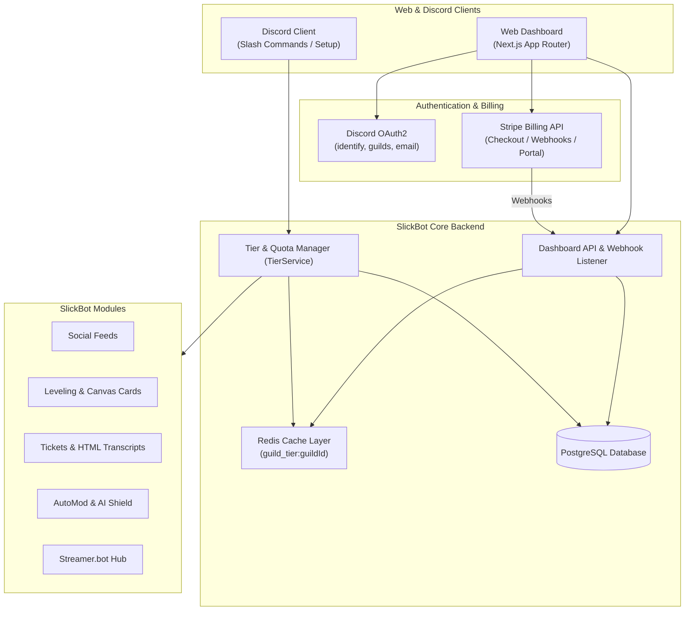
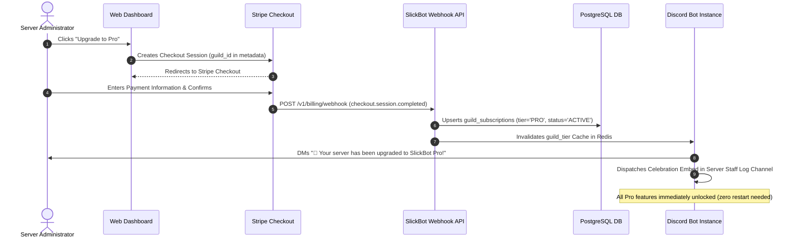

# 💻 SlickBot Web Dashboard, Billing & Quota Architecture Plan

## Executive Summary & Vision

To transition SlickBot into a scalable, self-sustaining platform, we require a high-performance **Web Management Dashboard** paired with a transparent, automated **Stripe Billing & Quota Enforcement Engine**.

This document outlines:
1. **Fullstack Web Dashboard Architecture:** Next.js (App Router), Discord OAuth2, and real-time Discord embed/panel visual designers.
2. **Tier & Quota Architecture:** Clear division between the **Free Community Tier** and **SlickBot Pro Tier ($4.99/mo or $49/yr)**.
3. **Module-by-Module Code Changes:** Step-by-step changes required across current SlickBot modules to enforce quotas cleanly without disrupting essential server management.
4. **Billing & Instant Unlock Lifecycle:** Stripe checkout, webhooks, Redis cache invalidation, and automated downgrade/grace period handling.

---

## 🏗️ System Architecture Overview



---

## 💎 Tier Structure & Resource Allocation Matrix

| Feature Area | Free Community Tier | SlickBot Pro Tier ($4.99/mo or $49/yr) |
| :--- | :--- | :--- |
| **Moderation & Logs** | Unlimited cases, notes, audit logs, and lockdowns | Unlimited + Priority Raid Shield |
| **Social Feeds** | Up to 3 active feeds (Twitch & YouTube) + Live Sticky Hub | Unlimited feeds (Kick, TikTok, Reddit, YouTube, Twitch, RSS) |
| **Custom Commands** | Up to 15 custom commands | Unlimited custom commands with advanced regex variables |
| **Leveling & Rank Cards** | Full XP engine, role multipliers, standard profile card | Custom Canvas graphic rank cards, custom background uploads, double-XP events |
| **Support & Tickets** | Unlimited tickets, reports, appeals, applications (TXT transcripts) | Self-contained dark-mode HTML transcripts, CSAT (1–5 Star) post-close surveys |
| **Streamer.bot Hub** | 1 connected channel, attendance XP, standard drop codes | Unlimited channels, Twitch Channel Points to Discord role automation, VIP drops |
| **AutoMod & Safety** | Core regex, anti-invite, anti-spam, duplicate message filters | AI Contextual Toxic Intent Detection, Ban-Evasion Shield |
| **FAQ & Knowledge Base** | Unlimited static `/faq` questions and reply triggers | AI Rule & FAQ Assistant (`/ask`) with RAG embeddings |
| **Sticky Messages** | Up to 2 sticky notice channels | Unlimited sticky notice channels with zero throttle delays |
| **Server Analytics** | 7-day message and voice activity stats | 90-day retention funnels, peak activity heatmaps, CSV/PDF report exports |
| **Branding & Deployment** | Standard SlickBot branding | Custom Bot White-Labeling (Custom bot name, avatar, status on dedicated compute) |

---

## 🗄️ Database Schema Additions

```sql
-- Subscription status and Stripe billing data per server
CREATE TABLE IF NOT EXISTS guild_subscriptions (
  guild_id TEXT PRIMARY KEY REFERENCES guild_configs(guild_id) ON DELETE CASCADE,
  tier TEXT NOT NULL DEFAULT 'FREE', -- 'FREE', 'PRO', 'ENTERPRISE'
  status TEXT NOT NULL DEFAULT 'ACTIVE', -- 'ACTIVE', 'TRIALING', 'PAST_DUE', 'CANCELED', 'EXPIRED'
  stripe_customer_id TEXT UNIQUE,
  stripe_subscription_id TEXT UNIQUE,
  plan_interval TEXT NOT NULL DEFAULT 'MONTHLY', -- 'MONTHLY', 'YEARLY'
  current_period_start TIMESTAMPTZ,
  current_period_end TIMESTAMPTZ,
  cancel_at_period_end BOOLEAN NOT NULL DEFAULT false,
  subscribed_by_user_id TEXT,
  created_at TIMESTAMPTZ NOT NULL DEFAULT NOW(),
  updated_at TIMESTAMPTZ NOT NULL DEFAULT NOW()
);

-- Resource usage tracking for fast quota evaluations
CREATE TABLE IF NOT EXISTS guild_resource_usage (
  guild_id TEXT PRIMARY KEY REFERENCES guild_configs(guild_id) ON DELETE CASCADE,
  social_feeds_count INTEGER NOT NULL DEFAULT 0,
  custom_commands_count INTEGER NOT NULL DEFAULT 0,
  sticky_channels_count INTEGER NOT NULL DEFAULT 0,
  calendar_subscriptions_count INTEGER NOT NULL DEFAULT 0,
  streamerbot_channels_count INTEGER NOT NULL DEFAULT 0,
  monthly_ai_tokens_used INTEGER NOT NULL DEFAULT 0,
  ai_tokens_reset_at TIMESTAMPTZ NOT NULL DEFAULT (NOW() + INTERVAL '30 days'),
  updated_at TIMESTAMPTZ NOT NULL DEFAULT NOW()
);

-- Webhook idempotency tracking for Stripe
CREATE TABLE IF NOT EXISTS stripe_webhook_events (
  event_id TEXT PRIMARY KEY,
  event_type TEXT NOT NULL,
  processed_at TIMESTAMPTZ NOT NULL DEFAULT NOW()
);

CREATE INDEX IF NOT EXISTS idx_guild_subscriptions_status ON guild_subscriptions(tier, status, current_period_end);
```

---

## 🛡️ Centralized Quota Enforcement Service (`TierService`)

In the bot codebase, create `src/services/tierService.js` to manage all tier checks consistently:

```javascript
const { query } = require('./db');

const Quotas = Object.freeze({
  FREE: {
    SOCIAL_FEEDS_MAX: 3,
    CUSTOM_COMMANDS_MAX: 15,
    STICKY_CHANNELS_MAX: 2,
    STREAMERBOT_CHANNELS_MAX: 1,
    CALENDARS_MAX: 1,
    CANVAS_RANK_THEMES: false,
    HTML_TRANSCRIPTS: false,
    AI_AUTOMOD_ENABLED: false,
    AI_TOKENS_PER_MONTH: 0,
    ANALYTICS_RETENTION_DAYS: 7,
    CSAT_SURVEYS: false,
    WHITE_LABELING: false
  },
  PRO: {
    SOCIAL_FEEDS_MAX: 1000,
    CUSTOM_COMMANDS_MAX: 1000,
    STICKY_CHANNELS_MAX: 1000,
    STREAMERBOT_CHANNELS_MAX: 1000,
    CALENDARS_MAX: 100,
    CANVAS_RANK_THEMES: true,
    HTML_TRANSCRIPTS: true,
    AI_AUTOMOD_ENABLED: true,
    AI_TOKENS_PER_MONTH: 500000,
    ANALYTICS_RETENTION_DAYS: 90,
    CSAT_SURVEYS: true,
    WHITE_LABELING: false
  }
});

class TierService {
  constructor() {
    this.cache = new Map(); // In-memory / Redis cache
  }

  async getGuildTier(guildId) {
    if (this.cache.has(guildId)) {
      const cached = this.cache.get(guildId);
      if (cached.expiresAt > Date.now()) return cached.tier;
    }

    const rows = await query(
      `SELECT tier, status, current_period_end FROM guild_subscriptions WHERE guild_id = $1`,
      [guildId]
    );

    let tier = 'FREE';
    if (rows.length > 0) {
      const sub = rows[0];
      if (sub.status === 'ACTIVE' || sub.status === 'TRIALING') {
        tier = sub.tier;
      }
    }

    this.cache.set(guildId, { tier, expiresAt: Date.now() + 5 * 60 * 1000 });
    return tier;
  }

  async getQuota(guildId, quotaKey) {
    const tier = await this.getGuildTier(guildId);
    return Quotas[tier][quotaKey] ?? Quotas.FREE[quotaKey];
  }

  async isPro(guildId) {
    const tier = await this.getGuildTier(guildId);
    return tier === 'PRO' || tier === 'ENTERPRISE';
  }

  invalidateCache(guildId) {
    this.cache.delete(guildId);
  }
}

module.exports = { TierService, Quotas };
```

---

## 🔧 Necessary Changes to Existing & Planned Modules

To implement the freemium model cleanly, the following changes must be added to current modules:

### 1. Social Feeds (`SOCIAL_FEEDS`)
* **Location:** `src/commands/feed.js` and `src/modules/automation/socialFeedService.js`
* **Change:** When `/feed add` is called:
  ```javascript
  const currentCount = await socialFeedService.getFeedCount(guildId);
  const maxAllowed = await tierService.getQuota(guildId, 'SOCIAL_FEEDS_MAX');

  if (currentCount >= maxAllowed) {
    return replyPrivate(interaction, {
      embeds: [buildUpgradeEmbed({
        title: 'Social Feed Limit Reached',
        description: `Your server has reached the limit of **${maxAllowed} active feeds** on the **Free Community Tier**.\n\nUpgrade to **SlickBot Pro** for unlimited feeds across Twitch, YouTube, Kick, TikTok, Reddit, and RSS!`,
        feature: 'Unlimited Social Feeds'
      })]
    });
  }
  ```

---

### 2. Custom Commands (`CUSTOM_COMMANDS`)
* **Location:** `src/commands/customCommand.js` and `src/modules/custom/customCommandService.js`
* **Change:** When `/customcommand add` is called:
  ```javascript
  const count = await customCommandService.getCommandCount(guildId);
  const limit = await tierService.getQuota(guildId, 'CUSTOM_COMMANDS_MAX');

  if (count >= limit) {
    return replyPrivate(interaction, {
      embeds: [buildUpgradeEmbed({
        title: 'Custom Command Limit Reached',
        description: `You are currently using **${count}/${limit}** custom commands on the **Free Tier**.\n\nUpgrade to **SlickBot Pro** for unlimited commands, regex matching, and dynamic variable scripts.`,
        feature: 'Unlimited Custom Commands'
      })]
    });
  }
  ```

---

### 3. Leveling & Canvas Rank Cards (`LEVELING`)
* **Location:** `src/commands/level.js` and `src/modules/community/levelingService.js`
* **Change:**
  - Free tier users get access to the clean standard rank embed cards.
  - When a user or admin attempts to set custom card backgrounds, custom animated SVG themes, or trigger server-wide double XP events via `/rank theme custom` or `/level event`:
  ```javascript
  const hasCustomThemes = await tierService.getQuota(guildId, 'CANVAS_RANK_THEMES');
  if (!hasCustomThemes) {
    return replyPrivate(interaction, {
      embeds: [buildUpgradeEmbed({
        title: 'Custom Rank Themes (SlickBot Pro)',
        description: 'Custom rank card background uploads, neon glassmorphism themes, and server-wide XP events require **SlickBot Pro**.',
        feature: 'Canvas Rank Themes & Double XP'
      })]
    });
  }
  ```

---

### 4. Support Workflows & HTML Transcripts (`TICKETS`, `APPEALS`, `APPLICATIONS`)
* **Location:** `src/modules/support/ticketService.js`
* **Change:**
  - **Free Tier:** Automatically generates and attaches the standard lightweight `.txt` transcript file upon ticket closure.
  - **Pro Tier:** Automatically generates a responsive, dark-mode `.html` transcript file with rich embed rendering, avatars, internal staff notes, and dispatches an interactive 5-star CSAT survey to the ticket opener's DMs.

---

### 5. Streamer.bot Integration (`STREAMERBOT`)
* **Location:** `src/modules/automation/streamerbotService.js`
* **Change:**
  - Free tier supports 1 connected channel and standard drop codes.
  - Pro tier unlocks multi-channel aggregation, automatic Twitch Channel Point to Temporary Role assignments, and high-frequency stream events.

---

### 6. AutoMod & Smart AI Shield (`AUTOMOD`, `FAQ`)
* **Location:** `src/modules/moderation/autoModService.js` and `src/commands/faq.js`
* **Change:**
  - Free tier enjoys 100% full access to all standard filters (Anti-Invite, Anti-Spam, Anti-Duplicate, Anti-Mention, Blacklists).
  - Pro tier unlocks the LLM Contextual Toxic Intent analyzer and the `/ask` RAG assistant that answers questions from the server rules.

---

## 💳 Stripe Billing & Instant Unlock Lifecycle



### Automated Downgrade & Cancellation Handling:
1. **Subscription Cancelled in Portal:**
   - `customer.subscription.updated` fired with `cancel_at_period_end = true`.
   - The server maintains full Pro access until `current_period_end`.
2. **Subscription Expires / Invoice Failed:**
   - `customer.subscription.deleted` or `invoice.payment_failed` fired.
   - `guild_subscriptions` updated to `status = 'EXPIRED'`, `tier = 'FREE'`.
   - Cache invalidated.
3. **Graceful Resource Handling on Downgrade:**
   - Existing feeds, commands, or data are **never deleted**.
   - Excess feeds (e.g. feed #4 and #5) are set to `paused = true`.
   - Bot sends a friendly notification to the staff channel:
     *"Your SlickBot Pro subscription has expired. Feeds beyond the free limit have been paused. You can resume them at any time by renewing in the dashboard."*

---

## 🖥️ Web Dashboard Architecture & Key Pages

### Technology Stack:
* **Framework:** Next.js 15 (App Router), React 19, TypeScript
* **Styling & UI:** Tailwind CSS, Radix UI primitives, Lucide React icons
* **Charts:** Recharts / Chart.js for server analytics
* **Hosting:** Vercel or Railway Container

### Key Dashboard Views:

```text
+-------------------------------------------------------------------------------+
| ⚡ SlickBot Dashboard   [ Server: SlickPickleNick's Community ▼ ]   [ @User ]  |
+-------------------------------------------------------------------------------+
| 📊 Overview       | 💎 CURRENT PLAN: SlickBot Pro ($49/yr)                     |
| ⚙️ Setup Wizard   | Renews on: August 26, 2027  [ Manage Billing Portal ]      |
| 🛡️ Moderation     |                                                           |
| 📢 Social Feeds   | 📊 ACTIVE USAGE QUOTAS:                                    |
| 🎟️ Support Hub    | • Social Feeds:        4 / Unlimited (Pro)                 |
| 🎮 Community Games| • Custom Commands:     12 / Unlimited (Pro)                |
| 📈 Analytics      | • Sticky Channels:     2 / Unlimited (Pro)                 |
| 💳 Billing & Plan | • AI Assistant Tokens: 42,500 / 500,000                   |
+-------------------------------------------------------------------------------+
```

1. **Server Overview & Selector:** Shows all servers where user has `ManageGuild` or `Administrator`. Displays whether the bot is installed with 1-click invite.
2. **Visual Embed & Reaction Role Builder:** Real-time WYSIWYG editor with live Discord dark-theme preview.
3. **Social Feeds Manager:** Add, edit, test, and preview Twitch, YouTube, Kick, and TikTok announcements.
4. **Ticket & Audit Transcript Portal:** Search past tickets and download/view self-contained HTML transcripts.
5. **Interactive Analytics Hub:** 90-day interactive charts of active chatting hours, voice engagement, and member retention funnels.
6. **Billing Portal Page:** Direct integration with Stripe Customer Portal allowing server owners to change payment methods, switch between monthly/annual billing, or download VAT invoices.

---

## 🚀 Phased Execution Roadmap

| Milestone | Key Deliverables |
| :--- | :--- |
| **Phase 1: Quota Infrastructure** | Build `guild_subscriptions` schema, `TierService.js` in bot, and add quota guards across existing commands (`/feed add`, `/customcommand add`, `/rank`). |
| **Phase 2: Stripe Billing Gateway** | Implement Stripe Checkout session generation, webhook receiver endpoint in bot API (`/v1/billing/webhook`), and automated upgrade celebration announcements. |
| **Phase 3: Next.js Web Dashboard** | Scaffold Next.js dashboard with Discord OAuth2 login, guild permission verification, and billing portal management. |
| **Phase 4: Visual Dashboard Editors** | Build visual Embed Builder, Reaction Role Canvas, and Live Ticket Transcript Browser. |
| **Phase 5: Public Launch & Promotion** | Launch `/pro` slash command in Discord, release web dashboard to public servers, and deploy automated billing lifecycle. |

---

*Related Documentation:*
* [SlickBot Development Roadmap](./DEVELOPMENT_ROADMAP.md) — Master product and module development roadmap.
* [Multi-Server Expansion Roadmap](./EXPANSION_ROADMAP.md) — Multi-tenancy and Discord verification guidelines.
